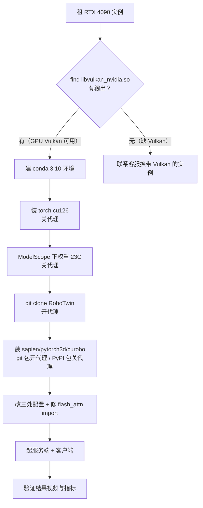
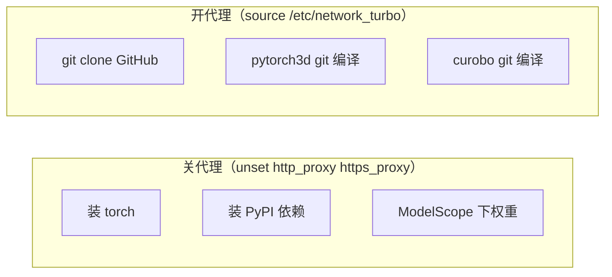
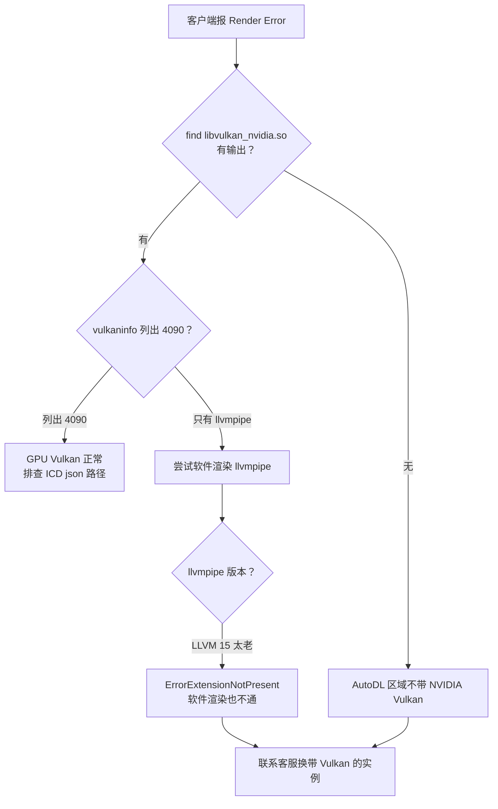

# AutoDL 部署 LingBot-VA 踩坑实战记录

> 这份文档记录了在 AutoDL（RTX 4090 单卡）上从零部署 LingBot-VA RoboTwin 评测的**完整真实过程**，配合 [CLOUD_DEPLOY.md](CLOUD_DEPLOY.md) 和 [DEPLOYMENT_CHECKLIST.md](DEPLOYMENT_CHECKLIST.md) 使用。
>
> 官方文档只讲了「正常路径」，这里补上「哪里会翻车 + 怎么救 + 为什么」。每个坑都按 **现象（完整报错原文）→ 根因 → 排查过程 → 解决命令 → 验证** 的结构展开，让后来者照报错就能定位、照命令就能修。
>
> **总耗时参考**：环境 + 依赖装通约 2–3 小时（含 pytorch3d 编译 30 分钟、权重下载 40 分钟），Vulkan 问题另算（本文档截止时仍未解决，见 §6）。

---

## 0. 最重要的结论先放前面

**AutoDL 部分区域/镜像不带 NVIDIA Vulkan 驱动，会导致 sapien 渲染直接失败（Render Error）。** 这是整个部署最容易翻车、且换镜像/换依赖都救不了的地方，务必在租卡后**第一时间验证**（见 §6）。别像我一样装完所有依赖才发现这一步过不去。

### 整体部署流程一览



### 部署的四个阶段（时间预算）

| 阶段 | 内容 | 时间 | 代理状态 |
|---|---|---|---|
| ① 租卡 | 租 RTX 4090、选镜像、连终端 | 5 分钟 | — |
| ② 环境 | conda 3.10 + torch + 依赖 | 30–40 分钟 | 关 |
| ③ RoboTwin | clone + sapien/pytorch3d/curobo | 40–60 分钟 | 开（git）|
| ④ 跑评测 | 改配置 + 起服务端/客户端 | 1–2 小时 | 无所谓 |

---

## 1. 租卡与磁盘：数据盘要够大、换区会丢数据

### 1.1 租卡选型

| 项 | 选择 | 说明 |
|---|---|---|
| GPU | **RTX 4090（24GB）** | 推理够用，offload 模式 ~24GB |
| 镜像 | PyTorch + CUDA 12.x | 实测驱动 580.105.08 / CUDA 13.0 可用 |
| 数据盘 | **≥100G** | 权重 23G + RoboTwin 资产 + 结果，50G 会爆 |

> ⚠️ 首次租了 **RTX 5090**，结果踩了 Blackwell（sm_120）的坑 —— cu126 的 torch 轮子不含 sm_120 内核，一跑就 `no kernel image available`。**老老实实用 4090（Ampere/Ada 架构），官方 cu126 栈直接兼容。**

### 1.2 三个磁盘坑

| 坑 | 现象 | 根因 | 解决 |
|---|---|---|---|
| 数据盘太小 | 权重 23G + 资产，50G 装不下 | 权重就有 23G | 数据盘 **≥100G** |
| 系统盘太小 | conda 环境默认装系统盘（30G）溢出 | conda 默认 `~/miniconda3` | conda env 放数据盘 |
| **换区丢数据盘** | bjb2 → bjb1 后数据盘清空 | 数据盘**不跨区迁移** | 换区前确认；换镜像（同区）才保留 |

### 现象（换区后数据盘被清空）

```bash
$ ls /root/autodl-tmp/
lingbot-va    # 只剩代码，权重/RoboTwin/conda 环境全没了
```

### 解决：conda 环境 + pip 缓存放数据盘

```bash
mkdir -p /root/autodl-tmp/conda_envs /root/autodl-tmp/pip_cache
conda config --add envs_dirs /root/autodl-tmp/conda_envs
pip config set global.cache-dir /root/autodl-tmp/pip_cache
```

### ⚠️ 关键区分：换镜像 vs 换区域

| 操作 | 系统盘 | 数据盘 |
|---|---|---|
| **换镜像 / 重置系统**（同区域）| 清空 | ✅ 保留 |
| **换区域 / 释放重租** | 清空 | ❌ 清空 |

> 教训：为了找带 Vulkan 的机器，从 bjb2 换到 bjb1，结果数据盘被清空，权重、RoboTwin、conda 环境全要重来。**换区前先确认数据盘迁移策略。**

---

## 2. Python 版本：必须建 3.10 环境

### 现象

```bash
$ python -V
Python 3.12.3   # AutoDL 镜像默认，装 RoboTwin 依赖会失败
```

### 根因

RoboTwin 依赖（`sapien==3.0.0b1` / `open3d==0.18.0` / `scipy==1.10.1`）**只有 py3.10 的轮子**，3.12 下 pip 找不到匹配版本。

### 解决

```bash
conda create -n lingbot python=3.10 -y
conda activate lingbot
python -V   # 必须是 3.10.x（实测 3.10.20 可用）
```

### ⚠️ 附带坑 1：`conda activate` 报错

```bash
$ conda activate lingbot
CondaError: Run 'conda init' before 'conda activate'
```

新 shell / 新镜像下 conda 未初始化。先：

```bash
conda init bash
source ~/.bashrc
conda activate lingbot
```

### ⚠️ 附带坑 2：screen 里环境丢失

进了 `screen` 后提示符变成 `(base)`，因为 **screen 是新 shell，不继承之前的 conda 激活状态**。每次进 screen 都要重新 `conda activate lingbot`。

---

## 3. 学术加速代理：开关时机是最大的坑

`source /etc/network_turbo`（AutoDL 学术加速）**只加速 GitHub/HuggingFace，对 pip/pytorch 源反而更慢**，甚至会劫持 `http://` 请求导致 pip 拉到空页面。

**核心原则：装 PyPI 包时关代理，拉 GitHub 时开代理。** 这次部署在这个坑上反复翻车了至少 4 次。



### 三种典型翻车现象（都是代理开关错了）

**现象 A：开代理装 PyPI 包 → `from versions: none`**

```bash
$ pip install sapien==3.0.0b1
Looking in indexes: http://mirrors.aliyun.com/pypi/simple
ERROR: Could not find a version that satisfies the requirement sapien==3.0.0b1 (from versions: none)
```

明明 aliyun 镜像上有这个包（`curl http://mirrors.aliyun.com/pypi/simple/sapien/` 能看到轮子），但 pip 就是「none」。根因：**代理劫持了 `http://mirrors.aliyun.com` 的请求**，pip 拿到空页面。

**现象 B：关代理拉 GitHub → 超时**

```bash
$ git clone https://github.com/.../pytorch3d.git
fatal: unable to access '...': GnuTLS recv error (-110): The TLS connection was non-properly terminated.
# 或
fatal: unable to access '...': SSL connection timeout
```

根因：国内直连 GitHub 不稳定，需要代理。

**现象 C：开代理装 torch → 卡死/极慢**

torch cu126 有 3–4GB，走学术加速代理限速严重。学术加速脚本自己都提示「开启加速后对 pip 源等会更慢」。

### 解决命令

```bash
# 关代理（装 PyPI / 下权重前）
unset http_proxy https_proxy all_proxy HTTP_PROXY HTTPS_PROXY ALL_PROXY

# 开代理（拉 GitHub 前）
source /etc/network_turbo
```

### 完整映射表（照着抄）

| 操作 | 代理状态 | 为什么 |
|---|---|---|
| 装 torch / pip 依赖 | **关** | 走 aliyun/清华镜像，代理反而慢+劫持 |
| ModelScope 下权重 | **关** | AutoDL 本机直连 ModelScope，飞快 |
| git clone GitHub | **开** | 国内直连 GitHub 不稳定 |
| pytorch3d / curobo 从 git 装 | **开** | 源码在 GitHub |
| 跑评测（服务端+客户端）| 无所谓 | 不联网，加载本地模型+本地仿真 |

---

## 4. torch 安装：用官方源，别用 aliyun pytorch-wheels

### 现象

```bash
$ pip install torch==2.9.0 --index-url https://mirrors.aliyun.com/pytorch-wheels/cu126/
Looking in indexes: https://mirrors.aliyun.com/pytorch-wheels/cu126/
ERROR: Could not find a version that satisfies the requirement torch==2.9.0 (from versions: none)
```

### 根因

aliyun 的 `pytorch-wheels` 页面是 **JS 渲染的 SPA**，浏览器能看到列表（`curl` 也能抓到 `<a href="torch-2.9.0+cu126-...whl">`），但 **pip 的 HTML 解析器不认这种页面**。而官方 `download.pytorch.org/whl/cu126` 是 nginx 目录列表（`<a href="torch-...whl">`），pip 能正常解析。

> 排查过程：先用 `curl -I` 确认 aliyun 返回 200，再用 `curl` 抓页面发现 `<a href>` 都在但 pip 报 none，最后对比官方源的 HTML 结构才发现差异。

### 解决

torch 用官方源（关代理后实测 ~5.7MB/s，可接受），其余小依赖走清华源：

```bash
# torch（关代理）
unset http_proxy https_proxy all_proxy
pip install torch==2.9.0 torchvision==0.24.0 torchaudio==2.9.0 \
    --index-url https://download.pytorch.org/whl/cu126

# 其余依赖（走清华源）
pip install websockets einops diffusers==0.36.0 transformers==4.55.2 \
    accelerate msgpack opencv-python matplotlib ftfy easydict \
    -i https://pypi.tuna.tsinghua.edu.cn/simple
```

### 验证

```bash
python -c "import torch; print(torch.__version__, torch.cuda.is_available())"
# 期望: 2.9.0+cu126 True
```

### 附带坑：numpy 版本冲突（可暂时忽略）

装 RoboTwin 依赖时，`scipy==1.10.1` / `open3d==0.18.0` 会强制把 numpy 从 2.x 降到 1.26.4，pip 警告：

```
opencv-python 5.0.0.93 requires numpy>=2, but you have numpy 1.26.4
```

这是官方依赖自己打架，**numpy 1.26.4 不能动**（open3d/sapien 必须它）。cv2 实测仍能 import，暂不处理。

---

## 5. RoboTwin 依赖：一堆隐形坑

### 5.1 `_install.sh` 假成功 ⚠️ 最容易上当

#### 现象

`bash script/_install.sh` 跑完显示「环境装好」，但实际 `import sapien` 报 `ModuleNotFoundError`。

#### 根因

RoboTwin 的 `_install.sh` **没有 `set -e`**，里面 `pip install -r requirements.txt` 失败后，脚本**继续往下跑、最后以 0 退出**，打印「Installation basic environment complete!」—— 纯属假成功。

#### 解决

**永远不要信脚本的「装好了」，装完手动 import 每个包验证**（见 §10 一键清单）。更稳的做法：**放弃 `_install.sh`，手动按依赖清单一步步装**，每步都能看到真实报错。

### 5.2 `sapien==3.0.0b1` 是预发布版

#### 现象

```bash
$ pip install sapien==3.0.0b1
ERROR: No matching distribution found for sapien==3.0.0b1
```

#### 根因

`3.0.0b1` 是 beta 预发布版，pip 默认不装预发布。

#### 解决

```bash
pip install "sapien==3.0.0b1" --pre
```

### 5.3 sapien import 报 `No module named 'pkg_resources'`

#### 现象

```bash
$ python -c "import sapien"
ModuleNotFoundError: No module named 'pkg_resources'
```

#### 根因

`sapien 3.0.0b1` 是老包，硬 `import pkg_resources`。新 setuptools（83.x）**删除了 `pkg_resources` 模块**。而 curobo 安装流程里又把 setuptools 折腾了一轮，最终 sapien 找不到这个模块。

#### 排查过程

1. `python -c "import sapien"` → `ModuleNotFoundError: No module named 'pkg_resources'`
2. `pip install setuptools` → 显示「already satisfied 83.0.0」，但 83.x 就是没 `pkg_resources` 的版本
3. 查 RoboTwin `_install.sh`，发现它里面对 setuptools 的处理是 `setuptools==69.5.1`

#### 解决

降级到还带 `pkg_resources` 的 setuptools 版本：

```bash
pip install "setuptools==69.5.1"
```

> 注意：直接 `pip install setuptools`（装最新 83.x）**没用**，因为 83.x 就是没 `pkg_resources` 的版本。必须显式指定 `==69.5.1`。

### 5.4 pytorch3d 编译：`--no-deps` 绕依赖解析

#### 现象

```bash
$ pip install "git+https://github.com/facebookresearch/pytorch3d.git@stable" --no-build-isolation
ERROR: Could not find a version that satisfies the requirement iopath (from pytorch3d) (from versions: none)
```

即使 `iopath` 已经手动装好了，pip **仍去查镜像验证依赖**（代理开着→空页面→报错）。

#### 根因

pip 的依赖解析器会去 index 验证 `iopath` 版本，而代理劫持导致查不到。

#### 解决：手动装依赖 + 手动 clone + `--no-deps`

```bash
# ① 关代理装依赖
unset http_proxy https_proxy all_proxy
pip install iopath fvcore

# ② 开代理手动 clone（比 pip 的 git 子进程更稳，可重试）
source /etc/network_turbo
git clone https://github.com/facebookresearch/pytorch3d.git
cd pytorch3d && git checkout stable

# ③ 本地装，--no-deps 跳过依赖检查（iopath/fvcore 已装）
pip install -e . --no-build-isolation --no-deps
```

> ⚠️ 三个关键点缺一不可：
> 1. **`--no-deps`** —— 否则又去查镜像报 iopath 错误
> 2. **手动 clone 而不是 `git+` URL** —— pip 的 git 子进程遇到代理抖动就 GnuTLS 失败，手动 clone 能重试（实测 clone 也失败过一次，重试才成功）
> 3. **进 screen 跑** —— 编译 15–30 分钟，SSH 一断就白编（本记录作者因此反复重来多次）

#### 附带坑：pytorch3d 编译时 CPU 吃满

pytorch3d 编译 C++/CUDA 扩展时 16 核 CPU 会吃满（100%），正常现象。编译日志在 `/tmp/p3d.log`，可用 `tail -f /tmp/p3d.log` 看进度（`tail -25` 会等命令结束才输出，看不到实时进度）。

### 5.5 curobo 依赖经 `nvidia-curobo`

#### 现象

```bash
$ pip install -e . --no-build-isolation   # 在 curobo 目录
ERROR: Could not find a version that satisfies the requirement importlib-resources (from nvidia-curobo) (from versions: none)
```

#### 根因

curobo 现在依赖 `nvidia-curobo`（改名的包），它又拉一堆依赖（importlib-resources 等）。**开代理装就会报上面的错**。

#### 解决

```bash
unset http_proxy https_proxy all_proxy   # 关代理
pip install -e . --no-build-isolation
```

> curobo 源码已经 clone 在本地了（`git clone` 报「destination path already exists」是正常的，之前 clone 过），本地装不需要代理，只要它的 pip 依赖能从 aliyun 拉就行，所以**关代理**。

---

## 6. 🔴 致命坑：NVIDIA Vulkan 驱动缺失（Render Error）

这是整个部署最核心、最影响结果的问题，也是**本文档截止时唯一还没解决**的问题。

### 现象

起客户端跑评测时，sapien 渲染初始化报：

```
Render Error
```

（只有这三个字，没有堆栈，直接退出。）

手动测渲染时更明确：

```bash
$ python -c "import sapien.core as sapien; scene=sapien.Scene(); r=sapien.SapienRenderer(); scene.set_renderer(r)"
RuntimeError: vk::PhysicalDevice::createDeviceUnique: ErrorExtensionNotPresent
```

### 根因

AutoDL 部分区域/镜像的容器里，NVIDIA 驱动**只挂载了 CUDA/GL/EGL 库，没有挂载 Vulkan ICD 库**（`libvulkan_nvidia.so`）。sapien 渲染需要 GPU Vulkan，找不到就失败。

### 排查决策树



### 验证命令（租卡后第一件事就跑这个）

```bash
find / -name "libvulkan_nvidia*" 2>/dev/null
vulkaninfo --summary 2>&1 | grep -iE "deviceName|deviceType"
```

**判断标准**：

| 结果 | 结论 |
|---|---|
| 找到 `libvulkan_nvidia.so` + vulkaninfo 列出 `NVIDIA GeForce RTX 4090` | ✅ GPU Vulkan 可用，可直接跑评测 |
| 只有 `llvmpipe (LLVM 15.0.7)` + 找不到 `libvulkan_nvidia.so` | ❌ 无 GPU Vulkan，别浪费时间装依赖 |

### 完整排查记录（供参考，避免重走弯路）

**步骤 1：确认库缺失**

```bash
$ ls /usr/share/vulkan/icd.d/
intel_hasvk_icd.x86_64.json  intel_icd.x86_64.json  lvp_icd.x86_64.json  radeon_icd.x86_64.json  virtio_icd.x86_64.json
# 注意：没有 nvidia_icd.json！

$ find / -name "libvulkan_nvidia*" 2>/dev/null
# 无输出 —— NVIDIA Vulkan ICD 库不存在

$ ls /usr/lib/x86_64-linux-gnu/ | grep -i vulkan
libvulkan.so.1  libvulkan_intel.so  libvulkan_lvp.so  libvulkan_radeon.so  libvulkan_virtio.so
# 只有 Intel/lvp(软件)/radeon/virtio，没有 nvidia
```

**步骤 2：确认驱动 GL/EGL 在，但 Vulkan 不在**

```bash
$ ls /usr/lib/x86_64-linux-gnu/ | grep -i nvidia
libEGL_nvidia.so.580.105.08  libGLX_nvidia.so.580.105.08  libnvidia-eglcore.so.580.105.08 ...
# GL/EGL 都在，但就是没有 libvulkan_nvidia.so
```

**步骤 3：尝试补装（失败）**

```bash
$ apt-get install -y libnvidia-gl-580
# 包里有 libGLX_nvidia.so，nm 检查确实含 vk_icdGetInstanceProcAddr 符号
# 但：
#   1. 版本 580.178.04 与宿主内核 580.105.08 不匹配 → ERROR_INCOMPATIBLE_DRIVER
#   2. dpkg 解压报 Invalid cross-device link（/usr/share/egl 跨设备挂载），--force-overwrite 也绕不过

$ VK_ICD_FILENAMES=/usr/share/vulkan/icd.d/nvidia_icd.json vulkaninfo --summary
ERROR: [Loader Message] Code 0 : loader_scanned_icd_add: Could not get 'vkCreateInstance' via 'vk_icdGetInstanceProcAddr' for ICD libGLX_nvidia.so.0
vkCreateInstance failed with ERROR_INCOMPATIBLE_DRIVER
```

**步骤 4：尝试软件渲染（失败）**

```bash
$ export VK_ICD_FILENAMES=/usr/share/vulkan/icd.d/lvp_icd.x86_64.json
$ python -c "import sapien.core as sapien; scene=sapien.Scene(); r=sapien.SapienRenderer(); scene.set_renderer(r)"
RuntimeError: vk::PhysicalDevice::createDeviceUnique: ErrorExtensionNotPresent
# llvmpipe LLVM 15.0.7 太老，缺 sapien 需要的 Vulkan 扩展

$ apt-cache policy mesa-vulkan-drivers
Candidate: 23.2.1-1ubuntu3.1~22.04.4   # kisak PPA 对 jammy 也没提供更新版
```

### 走过的四条弯路总结

1. **换镜像**：驱动是宿主机统一挂载的，换镜像（换系统盘）不改变驱动挂载，没用
2. **换区域**：实测 bjb1、bjb2 两个区都无 NVIDIA Vulkan，还导致数据盘被清空（代价巨大）
3. **补装 `libnvidia-gl-580`**：版本不匹配（580.178.04 vs 宿主 580.105.08）+ dpkg 跨设备挂载报错
4. **软件渲染 llvmpipe**：LLVM 15 太老，kisak PPA 也升不了级

### 正解

**联系 AutoDL 客服，明确要求「带 NVIDIA Vulkan 驱动（`libvulkan_nvidia.so`）的实例/区域/镜像」**，用于跑 SAPIEN 渲染。这是唯一治本的路。

> 客服工单参考话术：
> 「我在 bjb2/bjb1 区租了 RTX 4090 实例，需要运行 SAPIEN（机器人仿真，依赖 Vulkan GPU 渲染），但容器内找不到 NVIDIA 的 Vulkan 驱动库 libvulkan_nvidia.so（vulkaninfo 只能列出 llvmpipe 软件渲染，sapien 报 Render Error）。请问哪个区域、哪类实例会挂载完整的 NVIDIA Vulkan 驱动？」

---

## 7. 服务端 `flash_attn` 硬导入（修改源码）

### 现象

服务端 `launch_server.sh` 启动后立刻崩溃：

```
File "/root/autodl-tmp/lingbot-va/wan_va/modules/model.py", line 32, in <module>
    from flash_attn import flash_attn_func
ModuleNotFoundError: No module named 'flash_attn'
```

### 根因

`wan_va/modules/model.py` 顶层**无条件** `import flash_attn`，即使配置里 `attn_mode="torch"` 也会执行。而代码逻辑里 `flash_attn_func` **只在 `attn_mode='flashattn'` 时才被用到**：

```python
if attn_mode == 'torch':
    self.attn_op = custom_sdpa          # ← 我们走这条，不用 flash_attn
elif attn_mode == 'flashattn':
    self.attn_op = flash_attn_func      # ← 只有这里用
```

### 解决：改 import 为「找不到就置 None」

编译 flash-attn 要几十分钟且容易失败，既然用不到，直接绕过。修改 `model.py` 第 29-32 行：

```python
try:
    from flash_attn_interface import flash_attn_func
except ImportError:
    try:
        from flash_attn import flash_attn_func
    except ImportError:
        flash_attn_func = None
```

用 Python 脚本原地修改：

```bash
python - <<'PY'
p = "wan_va/modules/model.py"
s = open(p, encoding="utf-8").read()
old = '''try:
    from flash_attn_interface import flash_attn_func
except:
    from flash_attn import flash_attn_func'''
new = '''try:
    from flash_attn_interface import flash_attn_func
except ImportError:
    try:
        from flash_attn import flash_attn_func
    except ImportError:
        flash_attn_func = None'''
assert old in s, "pattern not found"
s = s.replace(old, new)
open(p, "w", encoding="utf-8").write(s)
print("patched OK")
PY
```

> ⚠️ 注意：这是**改了源码**。如果你要跑 `attn_mode='flashattn'`（用 flash-attn 加速），就不能这么改，得老老实实编译 flash-attn。跑 `attn_mode='torch'`（评测默认）才安全。

---

## 8. 部署脚本的 sudo 问题

### 现象

```bash
$ bash cloud_robotwin_eval.sh robowin
cloud_robotwin_eval.sh: line 105: sudo: command not found
```

### 根因

AutoDL 容器是 root 用户，**没有 `sudo`**。脚本里的 `sudo apt ...` 直接失败。

### 解决

```bash
sed -i 's/sudo //g' cloud_robotwin_eval.sh
```

（脚本里 `sudo` 只出现在 `phase_robowin` 的 `apt update`/`apt install` 两行，删掉不影响其他 phase。）

---

## 9. 长任务务必用 screen

### 现象

SSH 断线（`client_loop: send disconnect: Broken pipe`），前台跑的 pip install / 编译直接被杀。这次部署因此反复重来，浪费了大量时间。

### 解决

所有长任务（pytorch3d 编译、模型加载、100 trial 评测）**必须进 screen**：

```bash
screen -S <name>      # 进去跑长任务
# Ctrl+A 然后 D 切出来（detach，命令继续后台跑）
screen -ls            # 看有哪些 screen
screen -r <name>      # 重新接回
screen -wipe          # 清理死掉的 screen
```

### ⚠️ 三个反复犯的错

1. **进了 screen 但没 `conda activate lingbot`** —— screen 是新 shell，提示符变 `(base)`，环境没切，装到 base 里去了
2. **前台跑长命令 + Ctrl+Z 挂起** —— 之后 `ps aux` 看到一堆 `T`（Stopped）状态的僵尸进程，dpkg 锁被占
3. **`tail -25` 看不到实时进度** —— `| tail -25` 要等命令结束才输出，想看实时进度用 `tee 日志 | tail` 后另开终端 `tail -f 日志`

---

## 10. 一键验证清单（部署完必跑）

```bash
conda activate lingbot
python -c "import torch; print('torch', torch.__version__, torch.cuda.is_available())"
python -c "import sapien; print('sapien', sapien.__version__)"
python -c "import pytorch3d; print('pytorch3d', pytorch3d.__version__)"
python -c "import curobo; print('curobo ok')"
python -c "import mplib; print('mplib ok')"
python -c "import open3d; print('open3d ok')"
python -c "import cv2; print('cv2', cv2.__version__)"
find / -name "libvulkan_nvidia*" 2>/dev/null   # 必须非空，否则 Vulkan 渲染不可用
```

**全部绿灯（尤其最后一条 `libvulkan_nvidia.so` 能找到）+ 服务端能监听 29056，才是真的部署成功。**

---

## 11. 从零部署命令全集（复制粘贴版）

> 适用于**已经确认有 NVIDIA Vulkan** 的实例（`find / -name "libvulkan_nvidia*"` 有输出）。如果没确认，先看 §6。

```bash
# ===== 阶段 ①：租卡（控制台操作）=====
# RTX 4090 + 数据盘 ≥100G + PyTorch/CUDA 镜像，SSH 连上后继续

# ===== 阶段 ②：环境 =====
# 关代理（装 PyPI 用）
unset http_proxy https_proxy all_proxy HTTP_PROXY HTTPS_PROXY ALL_PROXY

# conda env + pip 缓存放数据盘
mkdir -p /root/autodl-tmp/conda_envs /root/autodl-tmp/pip_cache
conda config --add envs_dirs /root/autodl-tmp/conda_envs
pip config set global.cache-dir /root/autodl-tmp/pip_cache

# 建 3.10 环境
conda create -n lingbot python=3.10 -y
conda init bash && source ~/.bashrc
conda activate lingbot

# 装 torch（官方源）
pip install torch==2.9.0 torchvision==0.24.0 torchaudio==2.9.0 \
    --index-url https://download.pytorch.org/whl/cu126

# 装其余依赖（清华源）
pip install websockets einops diffusers==0.36.0 transformers==4.55.2 \
    accelerate msgpack opencv-python matplotlib ftfy easydict \
    -i https://pypi.tuna.tsinghua.edu.cn/simple

# ===== 阶段 ③：RoboTwin + 权重 =====
# 下权重（关代理，ModelScope）
pip install modelscope -q
mkdir -p /root/autodl-tmp/models/lingbot-va-posttrain-robotwin
modelscope download --model Robbyant/lingbot-va-posttrain-robotwin \
    --local_dir /root/autodl-tmp/models/lingbot-va-posttrain-robotwin

# 拉代码（开代理，git）
source /etc/network_turbo
cd /root/autodl-tmp
git clone https://github.com/Robbyant/lingbot-va.git
git clone https://github.com/mosensefred/lingbot-va-deploy.git

# RoboTwin（开代理 git clone，装依赖时关代理）
git clone https://github.com/RoboTwin-Platform/RoboTwin.git
cd RoboTwin && git checkout 2eeec322 && cd ..

# 关代理装 RoboTwin 依赖
unset http_proxy https_proxy all_proxy
pip install "sapien==3.0.0b1" --pre
pip install "setuptools==69.5.1"   # 修 pkg_resources
pip install transforms3d==0.4.2 scipy==1.10.1 mplib==0.2.1 gymnasium==0.29.1 \
    trimesh==4.4.3 open3d==0.18.0 imageio==2.34.2 pydantic zarr openai \
    huggingface_hub==0.36.2 h5py "pyglet<2" wandb moviepy termcolor av matplotlib ffmpeg

# pytorch3d（依赖关代理装，本体开代理 clone）
pip install iopath fvcore
source /etc/network_turbo
git clone https://github.com/facebookresearch/pytorch3d.git
cd pytorch3d && git checkout stable && pip install -e . --no-build-isolation --no-deps && cd ..

# curobo（关代理装）
unset http_proxy https_proxy all_proxy
cd /root/autodl-tmp/RoboTwin/envs
git clone --branch v0.7.8 --depth 1 https://github.com/NVlabs/curobo.git  # 若已存在则跳过
cd curobo && pip install -e . --no-build-isolation && cd ..

# ===== 阶段 ④：配置 + 跑 =====
conda activate lingbot
cd /root/autodl-tmp/lingbot-va
MODEL_DIR=/root/autodl-tmp/models/lingbot-va-posttrain-robotwin
ROBOTWIN_DIR=/root/autodl-tmp/RoboTwin

# 改三处配置
sed -i "s|/path/to/pretrained/model|$MODEL_DIR|g" wan_va/configs/va_robotwin_cfg.py
sed -i "s|/path/to/your/robowin|$ROBOTWIN_DIR|g" evaluation/robotwin/eval_polict_client_openpi.py
grep -q "enable_offload = True" wan_va/configs/va_robotwin_cfg.py || \
  echo "va_robotwin_cfg.enable_offload = True" >> wan_va/configs/va_robotwin_cfg.py

# attn_mode -> torch
python - "$MODEL_DIR/transformer/config.json" <<'PY'
import json, sys
p = sys.argv[1]
d = json.load(open(p))
if d.get("attn_mode") != "torch":
    d["attn_mode"] = "torch"
    json.dump(d, open(p, "w"), indent=2)
PY

# 修 flash_attn import（见 §7）

# 起服务端 + 客户端（进 screen）
screen -S eval
bash evaluation/robotwin/launch_server.sh
# 等端口 29056 就绪后另起客户端
bash evaluation/robotwin/launch_client.sh results adjust_bottle
```

---

## 附：本次实战环境快照

- 平台：AutoDL，RTX 4090（24GB），128 核 CPU，1TB 内存
- 驱动：NVIDIA 580.105.08 / CUDA 13.0
- Python：3.10.20（conda `lingbot` 环境，位于数据盘 `/root/autodl-tmp/conda_envs/`）
- torch：2.9.0+cu126
- 关键依赖版本：sapien 3.0.0b1 / pytorch3d 0.7.8 / open3d 0.18.0 / scipy 1.10.1 / curobo v0.7.8 / setuptools 69.5.1
- 结果：环境与依赖全部装通，服务端正常监听 29056，客户端因缺 NVIDIA Vulkan 驱动报 Render Error（待换带 Vulkan 的实例解决）
