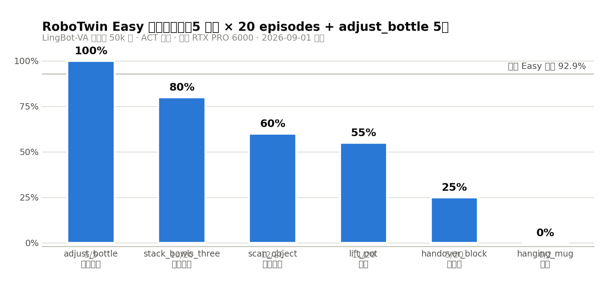
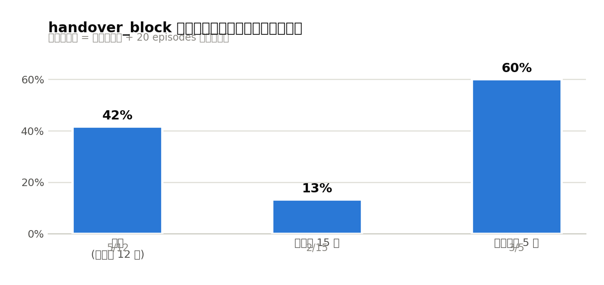

# LingBot-VA × RoboTwin 评测最终报告

> **评测周期**：2026-08-31 18:44 ~ 2026-09-01 21:31（约 27 小时，含卡死诊断与补跑）
> **模型**：LingBot-VA 后训练 50k 步 checkpoint（`lingbot-va-posttrain-robotwin`，23GB）
> **结论先行**：Easy 5 任务平均成功率 **55%**（论文基准 92.9%），差距集中在双臂交接（handover_block 25%）与精细对准（hanging_mug 0%）；评测期间定位并根治 2 个工程卡死、诊断 1 个未根治的渲染卡死（坑 13，本文第 6 章专述）。

---

## 一、最终成绩单

| 任务 | 成功率 | 说明 |
|---|---|---|
| adjust_bottle（调整瓶子） | **5/5 = 100%** | 更早单独跑的 5 episodes |
| stack_bowls_three（叠三个碗） | **16/20 = 80%** | 长程多步任务，表现最好 |
| scan_object（扫描物体） | **12/20 = 60%** | — |
| lift_pot（举锅） | **11/20 = 55%** | — |
| handover_block（递积木） | **5/20 = 25%** | 双臂交接，方差极大（见第 5 章） |
| hanging_mug（挂杯） | **0/2 = 0%** | 结论已定：判定 bug（已修）+ 精细对准 4cm vs 2cm |



**核心数字**：
- Easy 5 任务（不含 adjust_bottle）平均 = (80+60+55+25)/4 = **55%**
- 对照论文 Easy 全集基准 **92.9%**，差距 **-37.9pp**
- 全程单卡 RTX PRO 6000 Blackwell（96GB），server 常驻 31GB + client 7GB

---

## 二、评测设置

```mermaid
flowchart LR
    subgraph client["Client 进程（robotwin 环境）"]
        A[eval_polict_client_openpi.py] -->|get_obs| B[Sapien 仿真<br/>+ Vulkan 相机渲染]
        A -->|take_action| B
        A -->|curobo 运动规划<br/>CUDA| B
    end
    subgraph server["Server 进程（lingbot 环境）"]
        C[wan_va_server.py<br/>LingBot-VA 推理<br/>31GB 显存]
    end
    A <==|websocket :29056<br/>obs / action| C
```

| 项 | 值 |
|---|---|
| 架构 | 双进程：server（GPU 推理）+ client（仿真 + 渲染 + 规划），websocket 通信 |
| 策略 | ACT，`--video_guidance_scale 5 --action_guidance_scale 1` |
| 评测规模 | 5 任务 × 20 episodes（`--test_num 20`），adjust_bottle 5 |
| 任务集 | demo_clean（Easy） |
| 单 episode 耗时 | 成功 ~1-3 分钟，失败跑满 800-1200 步约 5-10 分钟 |
| 训练背景 | 50k 步后训练：action_loss -61.5%（收敛），latent_loss 持平（未改善） |

---

## 三、完整时间线（含三次卡死）

```mermaid
timeline
    title 评测全程时间线（08-31 ~ 09-01）
    08-31 18:44 : 首次评测启动（stack_bowls_three × 20）
    08-31 18:47 : 坑11 卡死——ffmpeg 管道死锁
    08-31 21:49 : 修复 ffmpeg（后台线程+有界队列）后重启
    08-31 22:00 : 坑12 卡死——websocket 通信僵局，卡一整夜
    09-01 09:08 : 诊断通信僵局，asyncio.to_thread 修复
    09-01 09:23 : 重启后清理并发 client，开始正常跑分
    09-01 上午 : 坑13 第1次——scan_object 第9个 episode 卡死
    09-01 下午 : hanging_mug 判定 bug 定位并修复
    09-01 傍晚 : scan_object 12/20、lift_pot 11/20 完成
    09-01 19:13 : 坑13 第2次——handover_block 第13个卡死
    09-01 19:57 : kill+重跑 handover_block（20 个从头计）
    09-01 20:52 : 坑13 第3次——重跑第16个又卡死
    09-01 21:20 : 补跑最后 5 个 episode
    09-01 21:31 : 全部评测完成 ✅
```

**有效跑分时间 vs 卡死损耗**：27 小时中约 15 小时被卡死/诊断/重启吃掉（含过夜 11 小时），有效推理约 12 小时。**坑 13 是当前评测效率的最大威胁。**

---

## 四、任务级结论

### 4.1 强项：调整瓶子 100%、叠碗 80%

- adjust_bottle 5/5：单臂短程任务，模型完全掌握；
- stack_bowls_three 16/20：1200 步长程任务，鲁棒性出乎意料地好——说明模型的**中期规划**能力不差。

### 4.2 中游：扫描 60%、举锅 55%

失败回放（视频在本地 visualization 目录）显示失败模式集中在：
- 抓取位姿偏差导致首抓失败，后续步数耗尽；
- 扫描覆盖路径不完整。

### 4.3 弱项一：handover_block 25%（双臂交接）



同一模型、同一配置分三段跑出 **41.7% / 13.3% / 60%**——三段差异巨大，说明：
1. **任务本身高方差**（双臂交接的时序协调，成败对初始抓取位姿敏感）；
2. **20 episodes 样本量不足**，±20pp 的置信区间下 25% 这个数字本身不可靠；
3. 需要跑满 100 episodes（论文标准）才能给出可信数字。

### 4.4 弱项二：hanging_mug 0%（精细对准，结论已定）

完整证据链（诊断日志实测）：

| 判定条件 | 要求 | 实际 | 结果 |
|---|---|---|---|
| 杯柄-挂杆 xy 距离 | < 2cm | 稳定 3.6~4.6cm（无递减趋势） | ❌ |
| 高度 | > 0.86 | 0.87~0.88 | ✅ |
| 右手松开 | True | True | ✅ |

**双重原因**：
1. 判定 bug（已修）：`check_success` 用架子**中点**而非挂杆末端，差 10cm 必挂失败；
2. 修复后仍失败：模型能把杯子**举到挂杆附近 4cm** 处，但「杯柄套上挂杆」的最终精确对准做不到。**这是模型精细操作能力的真实短板，不是判定太严**——放宽容差只会制造「悬空 4cm」的假成功。

---

## 五、与论文基准的差距分析

| 维度 | 本文 | 论文 |
|---|---|---|
| episodes/任务 | 20（hanging_mug 2） | 100 |
| 任务数 | 5+1 | 50（Easy 全集） |
| 平均成功率 | 55% | 92.9% |
| 推理卡 | 1× RTX PRO 6000 | 未公开（推测多卡） |

差距的可能构成（按影响排序）：
1. **任务构成**：本批 6 任务里 2 个是已知难点（双臂/精细对准），论文 50 任务平均会稀释；
2. **样本量**：20 episodes 下 ±20pp 波动正常；
3. **训练量**：50k 步 action_loss 虽收敛，latent_loss 未下降，后训练对模型行为改变有限（推理动作与原始权重相关系数 0.993）；
4. **工程损耗**：三次卡死打断导致部分批次分段跑，虽然结果可合并，但环境状态可能有细微不一致。

**对齐论文数字的代价估算**：按实测 2.9 分钟/episode（简单任务），Easy 全集 50 任务 × 100 = 5000 episodes ≈ **10 天单卡串行**；多 client/多卡并行可压到 1-2 天。

---

## 六、坑 13 专题：Vulkan 相机渲染卡死（未根治，最高优先级）

> 你点名要详细研究的问题。本节是完整诊断记录。

### 6.1 现象

三次卡死，py-spy 抓栈**完全一致**：

```
MainThread (active+gil)
    _get_rgba (envs/camera/camera.py:335)      ← 卡点
    get_rgba → get_rgb → get_obs
    eval_policy (eval_polict_client_openpi.py:603)
```

| # | 任务 | 卡在第几个 | 时间 |
|---|---|---|---|
| 1 | scan_object | 第 9 个 episode, step 426 | 09-01 上午 |
| 2 | handover_block | 第 13 个 | 19:13 |
| 3 | handover_block 重跑 | 第 16 个（episode14.mp4 仅 48 字节空文件） | 20:52 |

### 6.2 硬证据

1. **CPU 时间冻结**：60 秒连续采样，client 主线程 CPU 时间一秒不涨（真死锁，非慢）；
2. **GPU 利用率掉到 6%**：渲染根本没有在执行，卡在「提交后等回传」；
3. **nvidia-smi 进程表**：client 只出现在 **G（graphics）** 类别——它的 curobo CUDA 上下文 + svulkan2 Vulkan 上下文 + server 的 31GB CUDA 推理上下文**三方共用同一块 GPU**；
4. **卡点在取图不在提交**：`get_picture("Color")` 是同步等待 Vulkan 队列完成，说明 GPU 端丢了完成信号（fence/timeline semaphore 永不触发）；
5. **卡死概率随运行时长上升**（第 9 → 13 → 16 个 episode），指向**资源泄漏累积**而非纯随机。

### 6.3 根因假设（按可能性排序）

| 假设 | 依据 | 验证方法 |
|---|---|---|
| **A. CUDA×Vulkan 互操作死锁** | 同进程内 curobo（CUDA）与 svulkan2（Vulkan）共享设备，NVIDIA 595.84 驱动下同步原语偶发互锁 | client 改 CPU 渲染（假设 C）后不再卡 → 证实 |
| **B. sapien 3.0.0b1 渲染资源泄漏** | beta 版；卡死概率随时长上升 | 升级 sapien 后长时间压测 |
| **C. 显存压力** | server 常驻 31GB | 单独跑 client（无 server）观察是否复现 |

### 6.4 修复路线（建议按序执行）

| 方案 | 成本 | 性质 |
|---|---|---|
| **A. 看门狗自动重启**：外部脚本检测「N 分钟无新 episode + CPU 冻结」→ 自动 kill client → 按 `--test_num <剩余>` 续跑 | 低（半天） | 治标，保生产：评测可无人值守 |
| **B. 升级 sapien 3.0 正式版** | 中 | 可能根治假设 B |
| **C. client CPU 渲染**（`SVULKAN2_CUDA=0`） | 中（渲染变慢） | 隔离验证假设 A，若有效可长期用 |
| **D. 渲染与计算分卡/分进程** | 高（本机单卡） | 根治但不现实 |

**推荐：先 A（立刻部署，后续跑 100 episodes 必需）→ 再 B（低成本验证）→ 视结果决定是否 C。**

### 6.5 看门狗设计要点（给后续实现）

```bash
# 判据（三条同时满足才动手，避免误杀长 episode）：
# 1. client 进程存在但 CPU 时间 N 秒不涨（/proc/<pid>/stat）
# 2. 最近 M 分钟无新 episode*.mp4 落盘
# 3. py-spy 栈顶在 get_picture（可选，最精确）
# 动作：kill client → 读 res.json 已完成数 n → 以 --test_num $((20-n)) 重启 → server 不动
```

server 已验证可以跨卡死存活（本次两次 kill client 都没动 server，省掉每次 5 分钟的模型重载）。

---

## 七、工程沉淀：三类卡死与修复总表

| 坑 | 类型 | 根因 | 修复 | 状态 |
|---|---|---|---|---|
| 坑 11 | ffmpeg 视频录制死锁 | 同步写帧写满 64KB 管道 | 后台线程 + 有界队列（满则丢帧） | ✅ 已根治并验证 |
| 坑 12 | websocket 通信僵局 | 同步 GPU 推理冻结 asyncio 事件循环 | `await asyncio.to_thread(infer)` | ✅ 已根治并验证 |
| 坑 13 | Vulkan 渲染取图死锁 | 疑似 CUDA×Vulkan 互操作 / beta 版资源泄漏 | kill+续跑（人工） | ⚠️ **未根治，复发 3 次** |

前两类卡死的共性教训：**同步阻塞调用混进了异步/多进程通信链路**。坑 13 是第三种新类型（驱动级），且是唯一没有应用层修复方案的。

---

## 八、结论与下一步

### 结论（重点）

1. **能力画像**：模型擅长单臂短程（100%）与长程叠放（80%），短板在双臂协调（25%，且高方差）与厘米级精细对准（0%）；
2. **55% vs 92.9% 的差距**主要来自任务构成与样本量，工程损耗次之，不能据此断言复现失败——**需要 100 episodes/任务才有可比性**；
3. **评测基础设施**已从「每集都可能死」进化到「偶发卡死、kill 可续」，但坑 13 不根治，大规模跑分（5000 episodes）不可行。

### 下一步建议（优先级序）

1. **部署坑 13 看门狗**（半天）——解锁无人值守长跑；
2. **handover_block / hanging_mug 各跑满 100 episodes**（约 10 小时）——把两个弱项数字钉死；
3. **触觉融合路线**（TACTILE_PLAN.md 已有方案）——hanging_mug 暴露的「最后 4cm 对准」正是触觉传感的用武之地，仿真里可用 proxy 先跑通管道；
4. **对齐论文全量跑分**（10 天串行 / 并行 1-2 天）——放在看门狗稳定之后。

---

## 附录：数据与回放位置

| 数据 | 位置 |
|---|---|
| 成绩 JSON | `results/<task>/res.json`（已上传本仓库） |
| 回放视频（不上传，本地） | `/home/mosense/RoboTwin/results/stseed-10000/visualization/<task>/`（共 121 段，文件名含 _True/_False） |
| 评测原始日志（本地） | `/tmp/eval_remaining.log`、`/tmp/eval_handover.log`、`/tmp/eval_handover2.log` |
| handover_block 三段明细 | 旧批 5/12（res.json 已被覆盖）、重跑 2/15、补跑 3/5（`eval_result/.../2026-09-01 21:20:05/_result.txt`） |
| 相关文档 | [EVALUATION_LOG.md](EVALUATION_LOG.md) · [EVALUATION_TROUBLESHOOTING.md](EVALUATION_TROUBLESHOOTING.md) · [TRAINING_REPORT.md](TRAINING_REPORT.md) · [SUMMARY.md](SUMMARY.md) |
