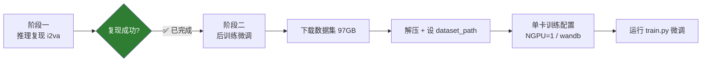
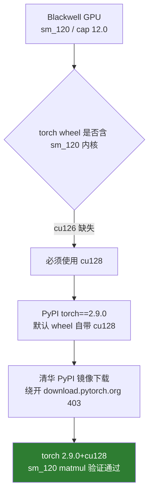
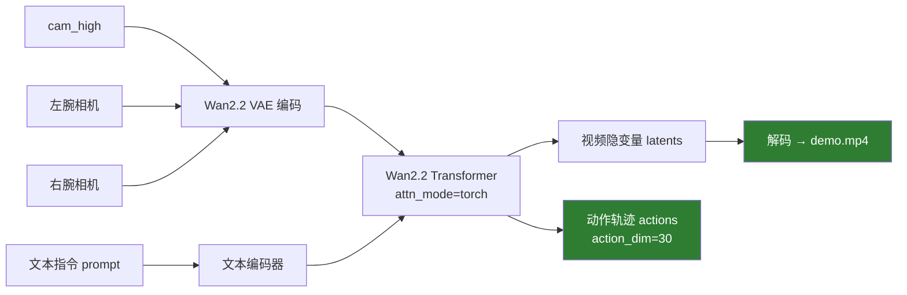
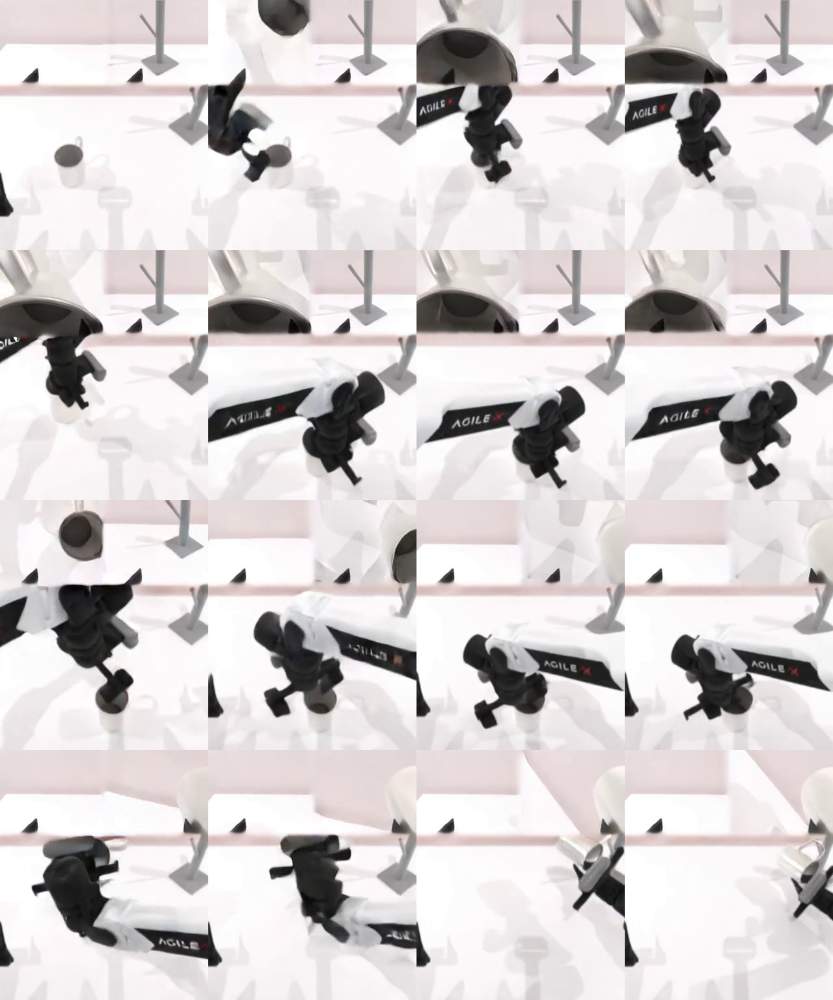
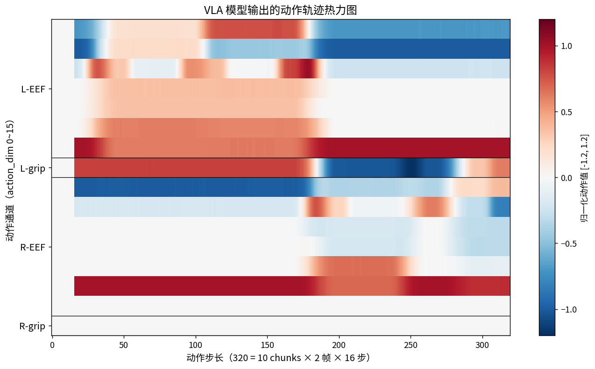
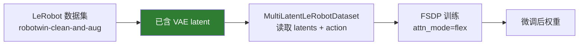

# LingBot-VA 本地部署与复现总结

> 在本机（Linux）部署 LingBot-VA（基于 Wan2.2 的机器人 VLA 模型），
> 分两阶段：**先跑通推理复现，再在预训练权重上复现后训练（微调）**。
>
> 记录时间：2026-08-28 ｜ 机器：单卡 RTX PRO 6000 Blackwell（96GB）

---

## 目录

1. [任务概述](#一任务概述)
2. [硬件与软件环境](#二硬件与软件环境)
3. [部署时间线](#三部署时间线)
4. [阶段一：推理复现 ✅](#四阶段一推理复现已完成)
5. [关键技术发现](#五关键技术发现)
6. [阶段二：后训练（进行中）](#六阶段二后训练进行中)
7. [目录结构](#七目录结构)
8. [常见问题 FAQ](#八常见问题-faq)
9. [磁盘提示](#九磁盘提示)

---

## 一、任务概述

**背景**：LingBot-VA 是一个基于 Wan2.2 的机器人 VLA（Vision-Language-Action）模型，
输入多路相机图像 + 文本指令，输出视频预测和 30 维动作轨迹，在 RoboTwin 仿真上评测。

**目标**：在不干扰机器上已有项目（lerobot / ACT / FASTWAM / elfesh）的前提下，
在本机完整复现 LingBot-VA 的推理与后训练流程。

**约束**：所有依赖装进独立的 conda 环境 `lingbot`，与其他项目环境完全隔离。



---

## 二、硬件与软件环境

| 项 | 值 | 说明 |
|---|---|---|
| GPU | NVIDIA RTX PRO 6000 Blackwell | sm_120 / compute cap **12.0** |
| 显存 | 96GB | 单卡即可承载推理与微调 |
| 驱动 / CUDA | 595.84 / 13.2 | |
| 环境隔离 | conda 独立环境 `lingbot` | Python 3.10.20 |
| 权重下载 | ModelScope | 23GB，支持断点续传 |
| PyPI 镜像 | 清华 `pypi.tuna.tsinghua.edu.cn` | 绕开 download.pytorch.org 403 |
| conda 镜像 | 清华（`.condarc`） | |

### 核心前提：Blackwell 必须用 torch cu128

Blackwell（sm_120）的 CUDA 内核在 cu126 的 torch wheel 里**不存在**，必须用 cu128：



验证结果：

```text
torch: 2.9.0+cu128   numpy: 1.26.4
cuda avail: True  |  capability: (12, 0)
sm_120 matmul OK（bf16 矩阵乘 + 反向均正常）
```

---

## 三、部署时间线

| 阶段 | 内容 | 结果 |
|---|---|---|
| 1 | 确认 Blackwell → torch 必须 cu128 | ✅ 清华镜像装 `torch==2.9.0` |
| 2 | ModelScope 下载 23GB 预训练权重 | ✅ 完整 |
| 3 | 修 `configs` 权重路径 + flash_attn import 补丁 | ✅ |
| 4 | 跑 i2va 独立推理 | ✅ demo.mp4 + 动作输出 |
| 5 | 张量校验（shape / 值域 / NaN） | ✅ 全部对齐 |
| 6 | 装训练依赖 lerobot/wandb/scipy | ✅（踩了 torch 降级坑，已修） |
| 7 | 验证 attn_mode=flex（torch 原生） | ✅ 正反向通过 |
| 8 | 调研数据集（已含 latent，97GB） | ✅ 待下载 |

---

## 四、阶段一：推理复现（已完成 ✅）

### 4.1 推理原理与流程



LingBot-VA 的 VLA 结构：三路相机（cam_high + 左右腕部）经 VAE 编码成视频隐变量，
与文本指令的 embedding 一起送入 Wan2.2 Transformer，同时产出**视频预测**和**动作轨迹**两条支路。

### 4.2 关键步骤与命令

```bash
# 1) 权重（已含 transformer / vae / text_encoder / tokenizer）
#    ModelScope: Robbyant/lingbot-va-posttrain-robotwin → /home/mosense/models/lingbot-va-posttrain-robotwin

# 2) 改权重路径（configs/va_robotwin_cfg.py）
va_robotwin_cfg.wan22_pretrained_model_name_or_path = "/home/mosense/models/lingbot-va-posttrain-robotwin"

# 3) 独立推理（configs/va_robotwin_i2va.py 里 infer_mode='i2va'）
python wan_va/wan_va_server.py --config-name robotwin_i2va
```

### 4.3 推理结果

预测视频共 **77 帧 / 10fps / 320×384**，采样 16 帧拼图：



8 帧精简版（更清晰）：


起止帧对比：

| 起点（第 0 帧） | 终点（第 76 帧） |
|---|---|
|  |  |

**画面布局说明**（由分辨率 320×384 = 256 + 128 推断）：

```text
┌─────────────────────────┐
│        cam_high          │  320 × 256（主相机，顶部）
├────────────┬────────────┤
│  left_wrist│ right_wrist │  各 160 × 128（腕部相机，底部并排）
└────────────┴────────────┘
```

### 4.4 动作轨迹热力图

把 10 组 `actions_*.pt` 按 chunk 顺序拼接，得到 **30 通道 × 320 步** 的动作矩阵，
其中 0~15 通道为有效维度（左臂 EEF 7 维 + 左夹爪 1 维 + 右臂 EEF 7 维 + 右夹爪 1 维），
16~29 为 padding。热力图如下：



### 4.5 张量校验

| 张量 | shape | dtype | 值域 | NaN |
|---|---|---|---|---|
| `actions[0]` | `(1, 30, 2, 16, 1)` | bfloat16 | 单文件 [-1, 1] | 0 |
| `actions[全部]` | `(30, 320)`（拼接后） | float32 | [-1.20, 1.05] | 0 |
| `latents[0]` | `(1, 48, 2, 24, 20)` | bfloat16 | 有限 | 0 |

`actions` 的 `(1, 30, 2, 16, 1)` 逐项对应配置 `action_dim=30 / frame_chunk_size=2 / action_per_frame=16`，
推理链路完整复现。

---

## 五、关键技术发现

### 5.1 torch 版本：cu126 无 sm_120 内核

cu126 的 torch 在 Blackwell 上会直接缺内核报错；PyPI 默认 `torch==2.9.0` wheel 自带 cu128
（`nvidia-cuda-runtime-cu12==12.8.90`）。通过清华 PyPI 镜像下载即可。

### 5.2 lerobot==0.3.3 的 `torch<2.8` 只是元数据上限（大坑）

直接 `pip install lerobot==0.3.3` 会把 torch 从 2.9.0(cu128) **降级到 2.7.1(cu126)**，
导致 Blackwell 再次不可用：

```text
# 降级后（错误状态）
nvidia-cuda-runtime-cu12  12.8.90 → 12.6.77   # cu128 → cu126
torch                      2.9.0  →  2.7.1

# 恢复命令
pip install torch==2.9.0 torchvision==0.24.0 torchaudio==2.9.0 numpy==1.26.4 \
    -i https://pypi.tuna.tsinghua.edu.cn/simple
```

恢复后实测 `lerobot 0.3.3` 在 `torch 2.9.0` 下 import 完全正常 → **两者共存，无需升级任何一方**。
官方 README 的安装命令本身就是 `pip install lerobot==0.3.3 scipy wandb --no-deps`（带 `--no-deps`），
就是为避免拖拽 torch。

### 5.3 attn_mode='flex' 不需要 flash-attn

`model.py` 有三种注意力模式：

```text
torch      → 朴素 SDPA（custom_sdpa，推理即用此）
flashattn  → flash_attn_func（需安装 flash-attn）
flex       → torch 原生 flex_attention + torch.compile（训练用此）
```

`flex` 模式用的是 `torch.nn.attention.flex_attention`（torch 自带），**不是 flash-attn**。
已冒烟测试：在 Blackwell(cu128) 上编译 + 前向 + 反向全部通过。结论：训练无需改 `train.py` 的
`attn_mode="flex"`，也无需装 flash-attn / nvcc。

### 5.4 lerobot 用途很窄，不能盲目升级

训练代码只在 `dataset/lerobot_latent_dataset.py` 用 lerobot，依赖 0.3.x 的 v2.1 数据集 API
（`LeRobotDatasetMetadata` / `meta.episodes` / `get_episode_chunk` / `get_episode_data_index`）。
lerobot 0.4+ 已重构为 v3.0 数据集格式，API 全变 → **升级会破坏数据加载**，务必锁 0.3.3。

### 5.5 数据集已含 latent，无需自己跑 VAE

`robotwin-clean-and-aug-lerobot` 官方 README 原文：

> "Robotwin dataset in Lerobot format, **with video latents already extracted in WAN 2.2 format**,
> ready for use in Lingbot-VA post-training."

即 VAE 编码这一步**官方已做好**，下载解压即可直接用。

---

## 六、阶段二：后训练（进行中）

### 6.1 环境就绪清单

| 组件 | 版本 | 状态 |
|---|---|---|
| torch | 2.9.0+cu128 | ✅ |
| numpy | 1.26.4 | ✅ |
| lerobot | 0.3.3 | ✅ import 正常 |
| wandb | 0.29.0 | ✅ |
| scipy | 1.15.3 | ✅ |
| flex_attention | torch 原生 | ✅ 正反向通过 |

### 6.2 后训练流程



### 6.3 待办清单

1. **下载数据集**（ModelScope，分卷 tarball 约 97GB）：

   ```bash
   # 分卷：robotwin-clean-and-aug-lerobot.tar.gz.aa / .ab（各约 52GB）
   modelscope download --dataset Robbyant/robotwin-clean-and-aug-lerobot
   ```

2. **解压**：`cat robotwin-clean-and-aug-lerobot.tar.gz.aa robotwin-clean-and-aug-lerobot.tar.gz.ab | tar xz`

3. **设 `dataset_path`**（`configs/va_robotwin_train_cfg.py`，当前为 `/path/to/your/dataset`）。

4. **单卡训练配置**：
   - `NGPU=1`（`run_va_posttrain.sh` 默认 8）；
   - 绕过 torchft（启动脚本用了 `--local-ranks-filter` 等 torchft 参数，`train.py` 本身不依赖 torchft）；
   - wandb：关闭 `enable_wandb` 或配真实凭据（脚本内为 `"your key"` 占位符）。

5. **运行**：
   ```bash
   python -m torch.distributed.run --nproc_per_node=1 -m wan_va.train --config-name robotwin_train
   ```

---

## 七、目录结构

```text
/home/mosense/
├── models/
│   └── lingbot-va-posttrain-robotwin/   # 23GB 预训练权重
│       ├── transformer/                  #   9.5G（config.json: attn_mode=torch）
│       ├── vae/                          #   2.7G
│       ├── text_encoder/                 #  11G
│       └── tokenizer/
├── lingbot-va/                           # 源码（非 git clone，直接解压）
│   ├── wan_va/
│   │   ├── wan_va_server.py              # 推理入口（i2va / server 两种模式）
│   │   ├── train.py                      # 训练入口（FSDP）
│   │   ├── configs/                      # va_robotwin_cfg / i2va / train 配置
│   │   ├── modules/model.py              # Wan2.2 Transformer（torch/flashattn/flex）
│   │   └── dataset/lerobot_latent_dataset.py  # 训练数据加载（依赖 lerobot 0.3.x）
│   └── inference_out/                    # 推理产物
│       ├── demo.mp4                      # 预测视频（77 帧 10fps）
│       └── real/<task>_<timestamp>/      # latents_*.pt + actions_*.pt
└── anaconda3/envs/lingbot/               # 独立 conda 环境
```

---

## 八、常见问题 FAQ

**Q1：直接 `pip install lerobot` 后推理报 cuda 内核错误？**
A：lerobot 把 torch 降级到了 cu126。重装 `torch==2.9.0`（cu128）即可，两者可共存。

**Q2：训练要不要装 flash-attn / nvcc？**
A：不用。`attn_mode='flex'` 走 torch 原生 flex_attention，torch 2.9.0 自带。

**Q3：需要自己用 VAE 抽 latent 吗？**
A：不需要。官方数据集 `robotwin-clean-and-aug-lerobot` 已含 latent。

**Q4：能升级 lerobot 到 0.4+ 吗？**
A：不建议。训练代码依赖 0.3.x 的 v2.1 数据集 API，0.4+ 已重构。

**Q5：会影响机器上其他项目吗？**
A：不会。所有依赖都在 `lingbot` conda 环境内，环境之间完全隔离。

---

## 九、磁盘提示

数据集 97GB（压缩）+ 解压约 100~130GB，峰值约 200GB；本机 `/` 当前可用约 213GB，
**能装下但偏紧**，建议下载前确认剩余空间。
