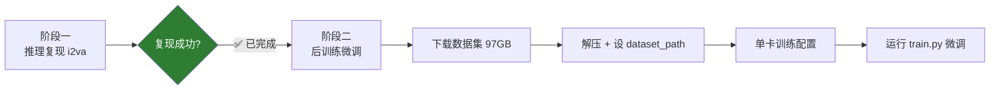
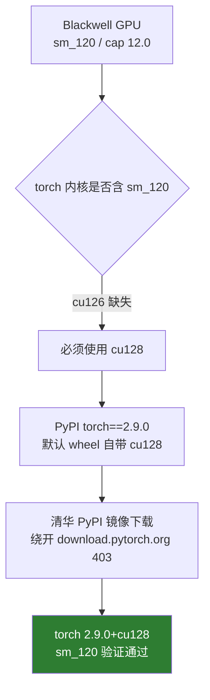
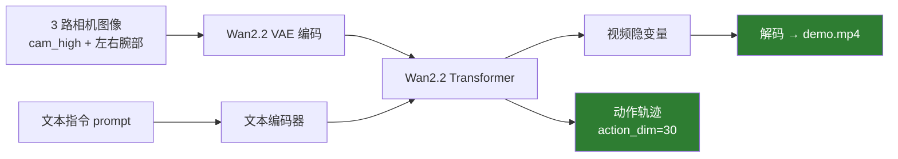
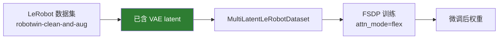

# LingBot-VA 本地部署与复现总结

> 在本机（Linux）部署 LingBot-VA（基于 Wan2.2 的机器人 VLA 模型）：先跑通推理复现，
> 再在预训练权重上复现后训练（微调）。记录时间：2026-08-28。

---

## 一、总体方案

两阶段推进，当前阶段一已完成、阶段二进行中：



---

## 二、硬件与软件环境

| 项 | 值 |
|---|---|
| GPU | NVIDIA RTX PRO 6000 Blackwell（sm_120 / compute cap 12.0），96GB 显存 |
| 驱动 / CUDA | 595.84 / 13.2 |
| 环境隔离 | conda 独立环境 `lingbot`（Python 3.10.20），不干扰 lerobot/ACT/FASTWAM/elfesh |
| 国内源 | conda 清华镜像（`.condarc`）、PyPI 清华镜像、ModelScope 下载权重/数据集 |

**核心前提：Blackwell 必须用 torch cu128**（cu126 无 sm_120 内核）：



---

## 三、阶段一：推理复现（已完成 ✅）

### 3.1 推理流程



### 3.2 关键步骤

- 通过 ModelScope 下载 23GB 预训练权重 `lingbot-va-posttrain-robotwin`
  （transformer 9.5G + vae 2.7G + text_encoder 11G + tokenizer）。
- 修改 `configs/va_robotwin_cfg.py` 的权重路径；`config.json` 已为 `attn_mode: torch`。
- 修复 `modules/model.py` 的 flash_attn import（缺失时回退 `None`，不再抛错）。
- 运行 `wan_va/wan_va_server.py` 的 i2va 独立推理（`infer_mode='i2va'`）成功，约 43s。

### 3.3 推理结果

预测视频（77 帧 / 10fps / 320×384），抽 8 帧拼图如下：


起止帧对比（左：第 0 帧；右：第 76 帧）：

| 起点 | 终点 |
|---|---|
|  |  |

产物（`inference_out/`）：`demo.mp4` + 10 组 `latents_*.pt` / `actions_*.pt`。

### 3.4 张量校验

动作张量与配置逐项对齐：

```
actions[0]  shape = (1, 30, 2, 16, 1)   # action_dim=30 / frame_chunk=2 / action_per_frame=16
             dtype = bfloat16, 值域 [-1, 1]（量化归一化区间）, NaN = 0
latents[0]  shape = (1, 48, 2, 24, 20)  # 视频隐变量, NaN = 0
```

---

## 四、关键技术踩坑与结论

1. **torch 版本**：cu126 无 sm_120 内核 → 必须 cu128；清华 PyPI 装 `torch==2.9.0`（默认 wheel 即 cu128）。

2. **lerobot==0.3.3 的 `torch<2.8` 只是元数据上限**：
   - 直接 `pip install lerobot==0.3.3` 会把 torch 2.9.0(cu128) 降级到 2.7.1(cu126)，
     破坏 Blackwell 支持（`nvidia-cuda-runtime` 从 12.8.90 回退 12.6.77）。
   - 修复：重装 `torch==2.9.0 + torchvision==0.24.0 + torchaudio==2.9.0 + numpy==1.26.4`，
     实测 lerobot 0.3.3 在 torch 2.9.0 下 import 正常 → **两者共存、无需升级任何一方**。
   - 官方安装命令本就是 `pip install lerobot==0.3.3 scipy wandb --no-deps`（带 `--no-deps`）。

3. **attn_mode='flex' 不需要 flash-attn**：
   - `model.py` 三种模式：`torch`（朴素 SDPA）、`flashattn`（需 flash-attn）、
     `flex`（用 **torch 原生** `flex_attention` + `torch.compile`）。
   - 已冒烟测试：flex_attention 在 Blackwell(cu128) 上编译 + 前向 + 反向全通过。
   - 结论：训练无需改 `train.py` 的 `attn_mode="flex"`，也无需装 flash-attn / nvcc。

4. **lerobot 用途很窄**：只在 `dataset/lerobot_latent_dataset.py` 用 lerobot，
   依赖 0.3.x 的 v2.1 数据集 API，0.4+ 已重构 → **不能盲目升级 lerobot**。

5. **数据集已含 latent**：`robotwin-clean-and-aug-lerobot` 官方 README 写明
   "video latents already extracted in WAN 2.2 format" → **无需自己跑 VAE 编码**。

---

## 五、阶段二：后训练（进行中）

环境已全部就绪（torch 2.9.0(cu128) / numpy 1.26.4 / lerobot 0.3.3 / wandb / scipy / flex_attention）。



**待办**：

1. 下载训练数据集 `robotwin-clean-and-aug-lerobot`（ModelScope，分卷 tarball 约 97GB）。
2. 解压（`cat aa ab | tar xz`）。
3. 在 `configs/va_robotwin_train_cfg.py` 设置 `dataset_path`。
4. 单卡训练配置：`NGPU=1`、绕过 torchft（train.py 本身不依赖 torchft）、处理 wandb。
5. 运行 `python -m torch.distributed.run --nproc_per_node=1 -m wan_va.train --config-name robotwin_train`。

---

## 六、磁盘提示

数据集 97GB（压缩）+ 解压约 100~130GB，峰值约 200GB；本机 `/` 当前可用约 213GB，
**能装下但偏紧**。
