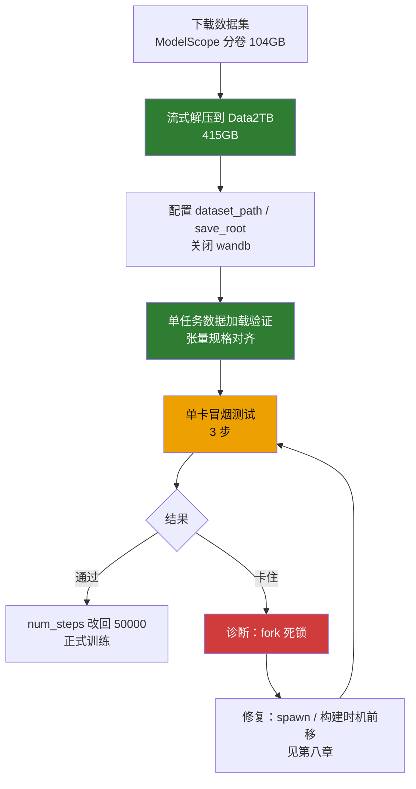

# LingBot-VA 阶段二：后训练（本地单卡）

> 本文档承接 `LOCAL_DEPLOY_SUMMARY.md` 的「六、阶段二：后训练」，记录后训练的实际执行结果与后续训练步骤。
> 状态：**数据集就绪、配置就绪；训练冒烟测试卡住，已定位根因（多进程 fork 死锁）**。

---

## 〇、执行流程图



---

## 一、当前进度总览

| 步骤 | 状态 | 说明 |
|---|---|---|
| 数据集下载 | ✅ 完成 | ModelScope 分卷 `.aa`(52.4G) + `.ab`(52.1G)，共约 104GB |
| 数据集解压 | ✅ 完成 | 流式解压到数据盘，共 **415GB** |
| `dataset_path` 配置 | ✅ 完成 | 指向 Data2TB 数据盘 |
| `enable_wandb` | ✅ 关闭 | 原配置为占位 key，训练前必须关 |
| `save_root` 配置 | ✅ 完成 | 指向 Data2TB（避开根分区，checkpoint 大） |
| 单任务数据加载 | ✅ 通过 | latents/actions/text_emb 张量规格全部对齐 |
| 单卡训练冒烟测试 | ⚠️ 卡住，已定位根因 | 详见「八、冒烟测试诊断：多进程 fork 死锁」 |

---

## 二、关键结论（本次执行新发现）

### 2.1 数据集解压后是 415GB，不是 130GB ⚠️

`LOCAL_DEPLOY_SUMMARY.md` 原估算「解压约 100~130GB」**严重偏低**。实际：

| 项 | 大小 |
|---|---|
| 压缩包（.aa + .ab） | 104GB |
| **解压后** | **415GB** |

根分区 `/` 仅 115GB 可用，**根本装不下**。这是本次执行遇到的最大的、文档未预料到的障碍。


### 2.2 解决方案：改用 Data2TB 数据盘

本机第二块盘 `/media/mosense/Data2TB`（1.8T，机械盘 WD20EZBX）有 539GB 可用，足够放下 415GB 数据集。

最终数据存放路径（**新建独立目录，不触碰盘上已有 `Projects/` 等项目**）：

```
/media/mosense/Data2TB/fred/lingbot-va-data/robotwin-clean-and-aug-lerobot/
```

### 2.3 数据集真实结构

```
robotwin-clean-and-aug-lerobot/
├── empty_emb.pt                    # 空文本 embedding [512, 4096] bf16
├── README.md
├── lerobot_robotwin_eef_aug_500/   # 增强集，50 个任务
│   └── <task>/
│       ├── data/chunk-000/         # *.parquet
│       ├── latents/                # 已提取的 VAE latent（*.pth）
│       ├── meta/                   # info.json + episodes.jsonl
│       └── videos/                 # 原始视频（训练不读）
└── lerobot_robotwin_eef_clean_50/  # 干净集，50 个任务
```

- **共 100 个子数据集**（50 aug + 50 clean），每个任务是一个独立 LeRobot v2.1 数据集。
- `dataset_path` 指向 `robotwin-clean-and-aug-lerobot/`，`recursive_find_file('info.json')` 会自动发现全部 100 个。
- 单任务实测：500 episode → `len(ds)=498`（2 个缺 latent 被 `_check_meta` 过滤）。


### 2.4 训练入口不依赖 torchft

`train.py` 用标准 `dist.init_process_group(backend="nccl", init_method="env://")`，读 `RANK/LOCAL_RANK/WORLD_SIZE` 环境变量，**不 import torchft**。因此单卡直接 `torch.distributed.run` 即可，无需 `run_va_posttrain.sh` 里的 `--local-ranks-filter` 等 torchft 参数。

### 2.5 训练时 `attn_mode` 无需改 config.json

`train.py` 加载 transformer 时**硬编码 `attn_mode="flex"`**（[train.py:88](../../lingbot-va/wan_va/train.py#L88)），会覆盖模型目录 `transformer/config.json` 里的 `"torch"`。所以训练**不需要**手动改 config.json（那个只在推理时读取）。

---

## 三、单任务数据加载验证（已通过）

实测单个任务 `adjust_bottle-aloha-agilex_randomized_500-1000`：

| 字段 | shape | dtype |
|---|---|---|
| latents | `[48, 9, 24, 20]` | bfloat16 |
| text_emb | `[512, 4096]` | bfloat16 |
| actions | `[30, 9, 16, 1]` | float32 |
| actions_mask | `[30, 9, 16, 1]` | bool |

与阶段一推理验证的张量规格一致，数据链路完整。

---

## 四、配置改动记录

文件 `configs/va_robotwin_train_cfg.py` 本次实际改动：

| 配置项 | 原值 | 现值 |
|---|---|---|
| `dataset_path` | `/path/to/your/dataset` | `/media/mosense/Data2TB/fred/lingbot-va-data/robotwin-clean-and-aug-lerobot` |
| `save_root` | `./train_out`（相对，会写根分区） | `/media/mosense/Data2TB/fred/lingbot-va-train-out` |
| `enable_wandb` | `True` | `False` |
| `num_steps` | `50000` | `3`（冒烟测试临时值，测试后改回） |

其余训练超参保持默认：`lr=1e-5`、`batch_size=1`、`gradient_accumulation_steps=1`、`save_interval=1000`、`gc_interval=50`、`cfg_prob=0.1`。

---

## 五、启动命令

### 5.1 单卡冒烟测试（当前运行中）

```bash
cd ~/lingbot-va
source ~/anaconda3/etc/profile.d/conda.sh && conda activate lingbot
PYTORCH_CUDA_ALLOC_CONF="expandable_segments:True" TOKENIZERS_PARALLELISM=false \
python -m torch.distributed.run --nproc_per_node=1 --master_port 29501 \
    -m wan_va.train --config-name robotwin_train
```

### 5.2 正式训练（冒烟通过后）

```bash
# 1) 把 num_steps 从 3 改回 50000
# 2) 启动
cd ~/lingbot-va
source ~/anaconda3/etc/profile.d/conda.sh && conda activate lingbot
PYTORCH_CUDA_ALLOC_CONF="expandable_segments:True" TOKENIZERS_PARALLELISM=false \
python -m torch.distributed.run --nproc_per_node=1 --master_port 29501 \
    -m wan_va.train --config-name robotwin_train
```

---

## 六、后续训练步骤（待办）

1. **先解决冒烟测试的 fork 死锁问题**（见「八、冒烟测试诊断」），再谈正式训练。
2. **把 `num_steps` 改回 50000**。
3. **解决 checkpoint 磁盘问题** ⚠️：
   - 单 checkpoint ≈ **9.5GB**（bf16 transformer）。
   - `save_interval=1000` × `num_steps=50000` → **50 个 checkpoint ≈ 475GB**。
   - Data2TB 解压后仅剩 **124GB**，根分区仅剩 114GB，**都存不下 475GB**。
   - 需要决策：减少 `save_interval`、只保留最后 N 个 checkpoint、或换更大磁盘。
4. **监控训练指标**：wandb 已关闭，需靠终端 `progress_bar` 输出观察 loss；若要曲线图需配真实 wandb 凭据。

---

## 七、磁盘现状（截至本文档）

| 磁盘 | 容量 | 已用 | 可用 | 用途 |
|---|---|---|---|---|
| `/`（nvme，系统盘） | 657G | 510G | 114G | 源码 / 权重 / conda 环境 |
| `/media/mosense/Data2TB`（sda，机械盘） | 1.8T | 1.6T | **124G** | 数据集 415G + 训练输出 |

> ⚠️ 数据盘剩余 124G 不足以存下 50 个 checkpoint（475G），正式训练前必须先定 checkpoint 策略。

---

## 八、冒烟测试诊断：多进程 fork 死锁

### 8.1 现象

冒烟测试（单卡 3 步）启动后，卡在「数据集构建」阶段超过 30 分钟，日志停在 `Generating train split` 进度条后不再增长，训练 loss 始终未出现。

### 8.2 排查过程（关键证据）

| 检查项 | 结果 | 含义 |
|---|---|---|
| 日志增长 | 10 秒 **0 字节** | 没有新输出 |
| 磁盘 %util（iostat） | sda **1%**、nvme 0.5% | **磁盘几乎空闲，不是 IO 瓶颈** |
| D 状态进程（不可中断，等磁盘 IO） | **0 个** | 无任何进程在等磁盘 |
| 主进程累计 CPU | 运行 33 分钟仅用 **1 分 02 秒** | 没有在计算 |
| 主进程 26 线程 wchan | 全部 `futex_do_wait` / `poll_schedule_timeout` | **在等锁** |
| 128 个 Pool worker wchan | `anon_pipe_read` / `futex_do_wait` | 等待任务 / 死锁 |
| 主进程打开的文件 | 仅 `/dev/nvidia0`、日志；**无任何 `.parquet`/`.pth`/`.mp4`** | 没有在读数据 |

> ⚠️ 之前文档里「机械盘 IO 慢导致数据集初始化慢」的判断是**错误的**——磁盘利用率仅 1%，真正原因是下面的多进程死锁。

### 8.3 根因分析

**`CUDA/FSDP 初始化之后 fork 多进程池导致的锁死锁。**

调用链：

```
Trainer.__init__
  ├─ load_transformer(...)          # 加载模型，开始用 CUDA
  ├─ apply_ac / shard_model / _configure_model   # FSDP 初始化 → 主进程变多线程(26 线程)、GPU 占 23GB
  └─ MultiLatentLeRobotDataset(config)          # ★ 在这里 fork
       └─ construct_lerobot_multi_processor
            └─ Pool(num_init_worker=128)        # ★ 用 multiprocessing.Pool(128) 并行构建 100 个子数据集
                 └─ pool.map(...)
```

关键点：`train.py` 里 `MultiLatentLeRobotDataset(config=config)` 是在**模型加载和 FSDP 配置之后**才调用的（[train.py:122](../../lingbot-va/wan_va/train.py#L122)）。此时主进程已经是多线程的 CUDA 进程。

`multiprocessing.Pool` 默认用 **fork** 启动子进程。fork 一个**多线程进程**时，子进程只复制调用 fork 的那一个线程，其余线程的锁（包括 CUDA 运行时的锁、Python GIL 的锁、以及 lerobot/huggingface 内部可能持有的锁）会被**原样冻结**地继承到子进程。

子进程如果之后需要获取一个「在被 fork 时正好被其他线程持有」的锁，就会**永久等待**——因为持锁线程没有被复制过来，永远不会释放。表现为：所有 worker 卡在 `futex_do_wait`，磁盘/CPU 全空闲，日志不再增长。

### 8.4 为什么不是「机械盘慢」

三条硬证据排除磁盘 IO 瓶颈：
1. `iostat` 显示 sda（机械盘）%util 仅 1%；
2. 没有任何进程处于 D 状态（D = 不可中断睡眠 = 等磁盘 IO）；
3. 主进程没有打开任何数据文件（`.parquet` / `.pth` / `.mp4`）。

机械盘确实比 SSD 慢，但**当前卡住与机械盘无关**。

### 8.5 解决方向（待验证）

1. **在 CUDA/FSDP 初始化之前构建数据集**：把 `MultiLatentLeRobotDataset` 的构建挪到 `load_transformer` / `shard_model` 之前，或挪到 Trainer 之外，让 Pool fork 发生在纯 CPU 单线程阶段。
2. **用 spawn 代替 fork**：设置 `multiprocessing.set_start_method('spawn')`，spawn 会重新执行子进程的 Python 解释器，不继承父进程的锁状态。但要注意 spawn 要求顶层代码可重新执行、且 `config` 对象需可序列化。
3. **减小/绕过 Pool 并行度**：`num_init_worker=128` 改成 `1`（串行构建），或直接逐个构建数据集，彻底规避 fork。串行会慢一些，但数据集构建是一次性的，可接受。
4. **改用 DataLoader 的 worker 而非 Pool**：依赖 PyTorch DataLoader 自带的进程管理（它内部正确处理了 fork 时机）。

### 8.6 关于「是否加装固态硬盘」

分两层回答：

| 问题 | 结论 |
|---|---|
| 能否解决当前 fork 死锁？ | **不能**。死锁与磁盘无关，换 SSD 一样卡。 |
| 对正式训练有无价值？ | **有**。训练时 DataLoader 要反复随机读 latent `.pth` 文件（100 子数据集 × 数千 latent），机械盘随机 IOPS 低，会成为训练吞吐瓶颈。若长期在此机训练，建议将数据集迁到 SSD，或至少用大容量 NVMe 数据盘。 |

> 建议优先级：**先解决 fork 死锁**（这是能否跑起来的硬门槛）→ 再评估 SSD（这是跑得快的优化项）。
