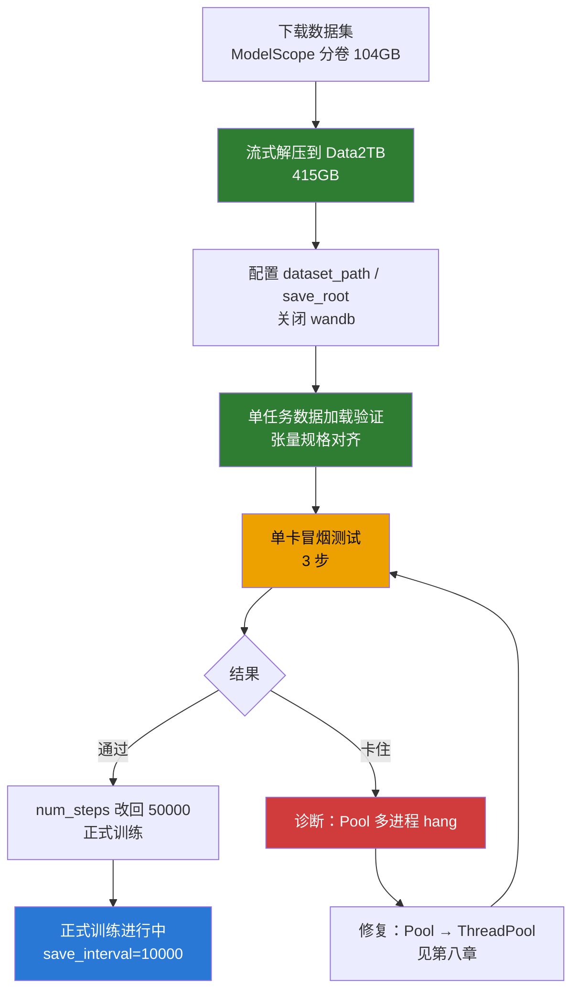

# LingBot-VA 阶段二：后训练（本地单卡）

> 本文档承接 `LOCAL_DEPLOY_SUMMARY.md` 的「六、阶段二：后训练」，记录后训练的实际执行结果与后续训练步骤。
> 状态：**正式训练进行中**（50000 步，单卡；冒烟测试已跑通，根因 `multiprocessing.Pool` → `ThreadPool` 已修复）。

---

## 〇、执行流程图



---

## 一、当前进度总览

| 步骤 | 状态 | 说明 |
|---|---|---|
| 数据集下载 | ✅ 完成 | ModelScope 分卷 `.aa`(52.4G) + `.ab`(52.1G)，共约 104GB |
| 数据集解压 | ✅ 完成 | 流式解压到数据盘，共 **415GB** |
| `dataset_path` 配置 | ✅ 完成 | 指向 Data2TB 数据盘 |
| `enable_wandb` | ✅ 关闭 | 原配置为占位 key，训练前必须关 |
| `save_root` 配置 | ✅ 完成 | 指向 Data2TB（避开根分区，checkpoint 大） |
| 单任务数据加载 | ✅ 通过 | latents/actions/text_emb 张量规格全部对齐 |
| 单卡训练冒烟测试 | ✅ **通过** | 3 步完成，latent_loss≈0.097、action_loss≈0.021；根因已修复（见第八章） |
| **正式训练** | 🔄 **进行中** | 50000 步，单卡，`save_interval=10000`（5 个 checkpoint），约 25 小时 |

---

## 二、关键结论（本次执行新发现）

### 2.1 数据集解压后是 415GB，不是 130GB ⚠️

`LOCAL_DEPLOY_SUMMARY.md` 原估算「解压约 100~130GB」**严重偏低**。实际：

| 项 | 大小 |
|---|---|
| 压缩包（.aa + .ab） | 104GB |
| **解压后** | **415GB** |

根分区 `/` 仅 115GB 可用，**根本装不下**。这是本次执行遇到的最大的、文档未预料到的障碍。


### 2.2 解决方案：改用 Data2TB 数据盘

本机第二块盘 `/media/mosense/Data2TB`（1.8T，机械盘 WD20EZBX）有 539GB 可用，足够放下 415GB 数据集。

最终数据存放路径（**新建独立目录，不触碰盘上已有 `Projects/` 等项目**）：

```
/media/mosense/Data2TB/fred/lingbot-va-data/robotwin-clean-and-aug-lerobot/
```

### 2.3 数据集真实结构

```
robotwin-clean-and-aug-lerobot/
├── empty_emb.pt                    # 空文本 embedding [512, 4096] bf16
├── README.md
├── lerobot_robotwin_eef_aug_500/   # 增强集，50 个任务
│   └── <task>/
│       ├── data/chunk-000/         # *.parquet
│       ├── latents/                # 已提取的 VAE latent（*.pth）
│       ├── meta/                   # info.json + episodes.jsonl
│       └── videos/                 # 原始视频（训练不读）
└── lerobot_robotwin_eef_clean_50/  # 干净集，50 个任务
```

- **共 100 个子数据集**（50 aug + 50 clean），每个任务是一个独立 LeRobot v2.1 数据集。
- `dataset_path` 指向 `robotwin-clean-and-aug-lerobot/`，`recursive_find_file('info.json')` 会自动发现全部 100 个。
- 单任务实测：500 episode → `len(ds)=498`（2 个缺 latent 被 `_check_meta` 过滤）。


### 2.4 训练入口不依赖 torchft

`train.py` 用标准 `dist.init_process_group(backend="nccl", init_method="env://")`，读 `RANK/LOCAL_RANK/WORLD_SIZE` 环境变量，**不 import torchft**。因此单卡直接 `torch.distributed.run` 即可，无需 `run_va_posttrain.sh` 里的 `--local-ranks-filter` 等 torchft 参数。

### 2.5 训练时 `attn_mode` 无需改 config.json

`train.py` 加载 transformer 时**硬编码 `attn_mode="flex"`**（[train.py:88](../../lingbot-va/wan_va/train.py#L88)），会覆盖模型目录 `transformer/config.json` 里的 `"torch"`。所以训练**不需要**手动改 config.json（那个只在推理时读取）。

### 2.6 checkpoint 不支持断点续训（官方未答复）

`save_checkpoint` 只保存模型权重（`diffusion_pytorch_model.safetensors` + `config.json`），**不保存 optimizer state**。续训功能是「半成品」：

| 位置 | 代码 | 状态 |
|---|---|---|
| `save_checkpoint` 保存 optimizer state | 第 339-342 行 | ❌ 被注释 |
| `save_checkpoint` 保存 `training_state.pt` | 第 367-374 行 | ❌ 被注释 |
| 调用 `_load_training_state` | 第 148-149 行 | ❌ 被注释 |
| `_load_training_state` 方法体 | 第 391-420 行 | ✅ 完整实现但未被调用 |

含义：
- checkpoint **可用于推理/评测**（模型权重完整）。
- checkpoint **不能用于断点续训**——训练中断只能从头开始。

官方 issue [#72「Train from the interrupted checkpoint」](https://github.com/Robbyant/lingbot-va/issues/72) 问的正是此事，**0 回复、OPEN 状态**，官方未说明为何注释。推测（无佐证）：FSDP 下 optimizer state 的 shard 映射易出错，或存储成本翻倍（optimizer state 约为模型权重 2 倍，fp32 下可能 40GB+）。

---

## 三、单任务数据加载验证（已通过）

实测单个任务 `adjust_bottle-aloha-agilex_randomized_500-1000`：

| 字段 | shape | dtype |
|---|---|---|
| latents | `[48, 9, 24, 20]` | bfloat16 |
| text_emb | `[512, 4096]` | bfloat16 |
| actions | `[30, 9, 16, 1]` | float32 |
| actions_mask | `[30, 9, 16, 1]` | bool |

与阶段一推理验证的张量规格一致，数据链路完整。

---

## 四、配置改动记录

文件 `configs/va_robotwin_train_cfg.py` 本次实际改动：

| 配置项 | 原值 | 现值 |
|---|---|---|
| `dataset_path` | `/path/to/your/dataset` | `/media/mosense/Data2TB/fred/lingbot-va-data/robotwin-clean-and-aug-lerobot` |
| `save_root` | `./train_out`（相对，会写根分区） | `/media/mosense/Data2TB/fred/lingbot-va-train-out` |
| `enable_wandb` | `True` | `False` |
| `num_steps` | `50000` | `3`（冒烟测试临时值，测试后改回） |

其余训练超参保持默认：`lr=1e-5`、`batch_size=1`、`gradient_accumulation_steps=1`、`save_interval=1000`、`gc_interval=50`、`cfg_prob=0.1`。

---

## 五、启动命令

### 5.1 单卡冒烟测试（当前运行中）

```bash
cd ~/lingbot-va
source ~/anaconda3/etc/profile.d/conda.sh && conda activate lingbot
PYTORCH_CUDA_ALLOC_CONF="expandable_segments:True" TOKENIZERS_PARALLELISM=false \
python -m torch.distributed.run --nproc_per_node=1 --master_port 29501 \
    -m wan_va.train --config-name robotwin_train
```

### 5.2 正式训练（冒烟通过后）

```bash
# 1) 把 num_steps 从 3 改回 50000
# 2) 启动
cd ~/lingbot-va
source ~/anaconda3/etc/profile.d/conda.sh && conda activate lingbot
PYTORCH_CUDA_ALLOC_CONF="expandable_segments:True" TOKENIZERS_PARALLELISM=false \
python -m torch.distributed.run --nproc_per_node=1 --master_port 29501 \
    -m wan_va.train --config-name robotwin_train
```

---

## 六、后续训练步骤（待办）

- ✅ `num_steps` 已改回 50000。
- ✅ checkpoint 磁盘问题已解决：`save_interval` 1000 → **10000**，50 个 checkpoint → **5 个**（约 47.5GB，数据盘放得下）。
- ⬜ **训练完成后**：评估 loss 曲线与 checkpoint 效果，确认是否达到预期。
- ⬜ **监控训练指标**：wandb 已关闭，需靠终端 `progress_bar` 输出观察 loss；若要曲线图需配真实 wandb 凭据。
- ⬜ **（可选，后续深入）研究 `multiprocessing.Pool` 卡住的底层机制**：是「fork 后 CUDA 上下文损坏」，还是「DDP 每 GPU 一进程 + 多进程数据构造叠加导致进程数爆炸 / 资源耗尽」？issue #32 里 GostInShell 倾向后者，但本机尚未用栈/资源监控直接证明。当前只需知道「Pool 是元凶、ThreadPool 可解」，暂不阻塞训练。

---

## 七、磁盘现状（截至本文档）

| 磁盘 | 容量 | 已用 | 可用 | 用途 |
|---|---|---|---|---|
| `/`（nvme，系统盘） | 657G | 510G | 114G | 源码 / 权重 / conda 环境 |
| `/media/mosense/Data2TB`（sda，机械盘） | 1.8T | 1.6T | **124G** | 数据集 415G + 训练输出 |

> ⚠️ 数据盘剩余 124G 不足以存下 50 个 checkpoint（475G），正式训练前必须先定 checkpoint 策略。

---

## 八、冒烟测试诊断：`multiprocessing.Pool` 多进程导致 hang（已修复）

### 8.1 现象

冒烟测试（单卡 3 步）启动后，卡在「数据集构建」阶段超过 30 分钟，日志停在 `Generating train split` 进度条后不再增长，训练 loss 始终未出现。

### 8.2 排查过程与证据

| 检查项 | 结果 | 含义 |
|---|---|---|
| 日志增长 | 10 秒 **0 字节** | 没有新输出 |
| 磁盘 %util（iostat） | sda **1%**、nvme 0.5% | **磁盘空闲，不是 IO 瓶颈** |
| D 状态进程（等磁盘 IO） | **0 个** | 无任何进程在等磁盘 |
| 主进程累计 CPU | 33 分钟仅 **1 分 02 秒** | 没有在计算 |
| 128 个 Pool worker wchan | 全部 `futex_do_wait` | **在等锁（死锁）** |
| 主进程打开的数据文件 | **0 个**（仅 `/dev/nvidia0` + 日志） | 没有在读数据 |

**关键实验：**

| 实验 | 结果 |
|---|---|
| 纯数据集构造（100 个数据集，无模型/CUDA） | ✅ 7 秒完成 → 排除「数据加载慢」 |
| fork 后 `torch.load`（不碰 CUDA） | ✅ 成功 → 排除「fork 本身必死锁」 |

### 8.3 根因（已实锤）

**`construct_lerobot_multi_processor` 用 `multiprocessing.Pool` 多进程并行加载数据集，在单卡 + FSDP 环境下会 hang。**

定位过程不是靠推理，而是靠两条外部+内部证据交汇：

1. **官方仓库 issue #32**（[Robbyant/lingbot-va#32](https://github.com/Robbyant/lingbot-va/issues/32)）：标题就是 `Does construct_lerobot_multi_processor hang for anyone else?`，多人报告**单卡下同样 hang**，共识是「别用多进程 Pool 加载数据，改线程或同步」。

2. **修复反证**：只改一个变量——`multiprocessing.Pool` → `multiprocessing.pool.ThreadPool`——训练就从「卡死 30 分钟」变成「3 步正常完成」。这是最强的一类证据。

### 8.4 修复

文件 `wan_va/dataset/lerobot_latent_dataset.py`：

```python
# 改动前
from multiprocessing import Pool
...
    with Pool(num_init_worker) as pool:
        datasets_out_lst = pool.map(construct_func, repo_list)

# 改动后
from multiprocessing.pool import ThreadPool
...
    with ThreadPool(num_init_worker) as pool:
        datasets_out_lst = pool.map(construct_func, repo_list)
```

**验证结果**：冒烟测试 3 步完成，`latent_loss=0.0972 / action_loss=0.0210 / grad_norm=0.50`，`Training completed!`。数据加载从「卡死」变为「约 29 秒」。

### 8.5 仍不确定的边界

- **具体底层机制未定位**：是「fork 后 CUDA 上下文不可用」还是「DDP 每 GPU 一进程 + 多进程数据构造叠加导致进程数爆炸」，issue 里有人倾向后者，但**没有在本机用栈/日志直接证明是哪一种**。
- 但「`Pool` 多进程是元凶」这一点，由修复反证支撑，**不再是猜测**。

### 8.6 为什么不是「机械盘慢」

三条硬证据排除磁盘 IO 瓶颈：
1. `iostat` 显示 sda（机械盘）%util 仅 1%；
2. 没有任何进程处于 D 状态；
3. 纯数据集构造（100 个数据集）实测仅 7 秒。

### 8.7 关于「是否加装固态硬盘」

| 问题 | 结论 |
|---|---|
| 能否解决 Pool hang？ | **不能**。与磁盘无关。 |
| 对正式训练有无价值？ | **有**。训练时 DataLoader 反复随机读 latent `.pth` 文件，机械盘随机 IOPS 低会成为吞吐瓶颈。若长期训练，建议数据集迁 SSD。 |

### 8.8 诊断教训（重要）

本次定位绕了大弯，教训必须记：

1. **我先给了两个错误结论**：「磁盘慢」（没先测 iostat）和「fork 锁冻结」（机制是编的）。
2. **正确方向来自 GitHub issue #32**——外部踩坑者的共识，而不是我的推理。遇到已知项目的问题，**先搜官方 issue**，往往比自己复现快得多。
3. **最终是「修复反证」一锤定音**：改一个变量看现象翻转，比反复复现更可靠。
4. 诊断过程中，我一度把「卡在 99 个 split 后」和「卡在 0 个 split」当成同一个现象，还说过「完整复现成功」——**把相似当相同，是错误的重要来源**。
