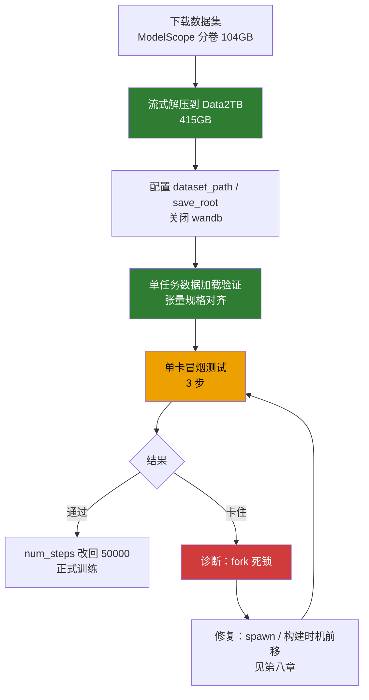
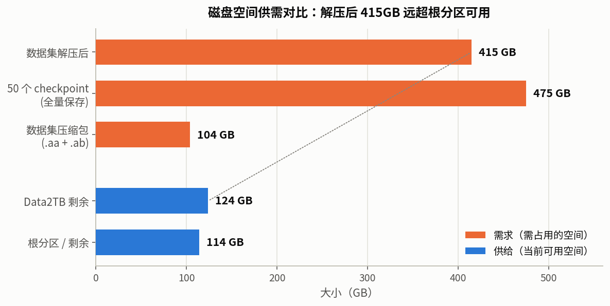
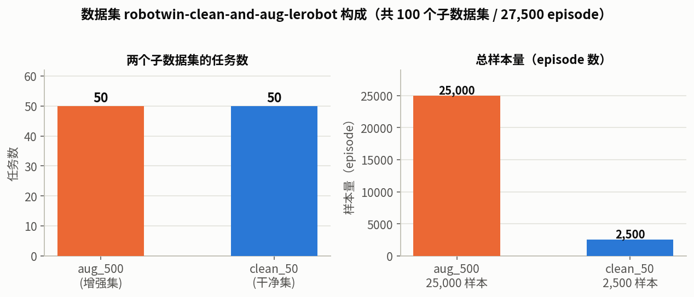

# LingBot-VA 阶段二：后训练（本地单卡）

> 本文档承接 `LOCAL_DEPLOY_SUMMARY.md` 的「六、阶段二：后训练」，记录后训练的实际执行结果与后续训练步骤。
> 状态：**数据集就绪、配置就绪；训练冒烟测试卡住，已定位根因（多进程 fork 死锁）**。

---

## 〇、执行流程图



---

## 一、当前进度总览

| 步骤 | 状态 | 说明 |
|---|---|---|
| 数据集下载 | ✅ 完成 | ModelScope 分卷 `.aa`(52.4G) + `.ab`(52.1G)，共约 104GB |
| 数据集解压 | ✅ 完成 | 流式解压到数据盘，共 **415GB** |
| `dataset_path` 配置 | ✅ 完成 | 指向 Data2TB 数据盘 |
| `enable_wandb` | ✅ 关闭 | 原配置为占位 key，训练前必须关 |
| `save_root` 配置 | ✅ 完成 | 指向 Data2TB（避开根分区，checkpoint 大） |
| 单任务数据加载 | ✅ 通过 | latents/actions/text_emb 张量规格全部对齐 |
| 单卡训练冒烟测试 | ⚠️ 卡住，已定位根因 | 详见「八、冒烟测试诊断：多进程 fork 死锁」 |

---

## 二、关键结论（本次执行新发现）

### 2.1 数据集解压后是 415GB，不是 130GB ⚠️

`LOCAL_DEPLOY_SUMMARY.md` 原估算「解压约 100~130GB」**严重偏低**。实际：

| 项 | 大小 |
|---|---|
| 压缩包（.aa + .ab） | 104GB |
| **解压后** | **415GB** |

根分区 `/` 仅 115GB 可用，**根本装不下**。这是本次执行遇到的最大的、文档未预料到的障碍。



### 2.2 解决方案：改用 Data2TB 数据盘

本机第二块盘 `/media/mosense/Data2TB`（1.8T，机械盘 WD20EZBX）有 539GB 可用，足够放下 415GB 数据集。

最终数据存放路径（**新建独立目录，不触碰盘上已有 `Projects/` 等项目**）：

```
/media/mosense/Data2TB/fred/lingbot-va-data/robotwin-clean-and-aug-lerobot/
```

### 2.3 数据集真实结构

```
robotwin-clean-and-aug-lerobot/
├── empty_emb.pt                    # 空文本 embedding [512, 4096] bf16
├── README.md
├── lerobot_robotwin_eef_aug_500/   # 增强集，50 个任务
│   └── <task>/
│       ├── data/chunk-000/         # *.parquet
│       ├── latents/                # 已提取的 VAE latent（*.pth）
│       ├── meta/                   # info.json + episodes.jsonl
│       └── videos/                 # 原始视频（训练不读）
└── lerobot_robotwin_eef_clean_50/  # 干净集，50 个任务
```

- **共 100 个子数据集**（50 aug + 50 clean），每个任务是一个独立 LeRobot v2.1 数据集。
- `dataset_path` 指向 `robotwin-clean-and-aug-lerobot/`，`recursive_find_file('info.json')` 会自动发现全部 100 个。
- 单任务实测：500 episode → `len(ds)=498`（2 个缺 latent 被 `_check_meta` 过滤）。



### 2.4 训练入口不依赖 torchft

`train.py` 用标准 `dist.init_process_group(backend="nccl", init_method="env://")`，读 `RANK/LOCAL_RANK/WORLD_SIZE` 环境变量，**不 import torchft**。因此单卡直接 `torch.distributed.run` 即可，无需 `run_va_posttrain.sh` 里的 `--local-ranks-filter` 等 torchft 参数。

### 2.5 训练时 `attn_mode` 无需改 config.json

`train.py` 加载 transformer 时**硬编码 `attn_mode="flex"`**（[train.py:88](../../lingbot-va/wan_va/train.py#L88)），会覆盖模型目录 `transformer/config.json` 里的 `"torch"`。所以训练**不需要**手动改 config.json（那个只在推理时读取）。

---

## 三、单任务数据加载验证（已通过）

实测单个任务 `adjust_bottle-aloha-agilex_randomized_500-1000`：

| 字段 | shape | dtype |
|---|---|---|
| latents | `[48, 9, 24, 20]` | bfloat16 |
| text_emb | `[512, 4096]` | bfloat16 |
| actions | `[30, 9, 16, 1]` | float32 |
| actions_mask | `[30, 9, 16, 1]` | bool |

与阶段一推理验证的张量规格一致，数据链路完整。

---

## 四、配置改动记录

文件 `configs/va_robotwin_train_cfg.py` 本次实际改动：

| 配置项 | 原值 | 现值 |
|---|---|---|
| `dataset_path` | `/path/to/your/dataset` | `/media/mosense/Data2TB/fred/lingbot-va-data/robotwin-clean-and-aug-lerobot` |
| `save_root` | `./train_out`（相对，会写根分区） | `/media/mosense/Data2TB/fred/lingbot-va-train-out` |
| `enable_wandb` | `True` | `False` |
| `num_steps` | `50000` | `3`（冒烟测试临时值，测试后改回） |

其余训练超参保持默认：`lr=1e-5`、`batch_size=1`、`gradient_accumulation_steps=1`、`save_interval=1000`、`gc_interval=50`、`cfg_prob=0.1`。

---

## 五、启动命令

### 5.1 单卡冒烟测试（当前运行中）

```bash
cd ~/lingbot-va
source ~/anaconda3/etc/profile.d/conda.sh && conda activate lingbot
PYTORCH_CUDA_ALLOC_CONF="expandable_segments:True" TOKENIZERS_PARALLELISM=false \
python -m torch.distributed.run --nproc_per_node=1 --master_port 29501 \
    -m wan_va.train --config-name robotwin_train
```

### 5.2 正式训练（冒烟通过后）

```bash
# 1) 把 num_steps 从 3 改回 50000
# 2) 启动
cd ~/lingbot-va
source ~/anaconda3/etc/profile.d/conda.sh && conda activate lingbot
PYTORCH_CUDA_ALLOC_CONF="expandable_segments:True" TOKENIZERS_PARALLELISM=false \
python -m torch.distributed.run --nproc_per_node=1 --master_port 29501 \
    -m wan_va.train --config-name robotwin_train
```

---

## 六、后续训练步骤（待办）

1. **先解决冒烟测试的 fork 死锁问题**（见「八、冒烟测试诊断」），再谈正式训练。
2. **把 `num_steps` 改回 50000**。
3. **解决 checkpoint 磁盘问题** ⚠️：
   - 单 checkpoint ≈ **9.5GB**（bf16 transformer）。
   - `save_interval=1000` × `num_steps=50000` → **50 个 checkpoint ≈ 475GB**。
   - Data2TB 解压后仅剩 **124GB**，根分区仅剩 114GB，**都存不下 475GB**。
   - 需要决策：减少 `save_interval`、只保留最后 N 个 checkpoint、或换更大磁盘。
4. **监控训练指标**：wandb 已关闭，需靠终端 `progress_bar` 输出观察 loss；若要曲线图需配真实 wandb 凭据。

---

## 七、磁盘现状（截至本文档）

| 磁盘 | 容量 | 已用 | 可用 | 用途 |
|---|---|---|---|---|
| `/`（nvme，系统盘） | 657G | 510G | 114G | 源码 / 权重 / conda 环境 |
| `/media/mosense/Data2TB`（sda，机械盘） | 1.8T | 1.6T | **124G** | 数据集 415G + 训练输出 |

> ⚠️ 数据盘剩余 124G 不足以存下 50 个 checkpoint（475G），正式训练前必须先定 checkpoint 策略。

---

## 八、冒烟测试诊断：CUDA 初始化后 fork 多进程死锁

### 8.1 现象

冒烟测试（单卡 3 步）启动后，卡在「数据集构建」阶段超过 30 分钟，日志停在 `Generating train split` 进度条后不再增长，训练 loss 始终未出现。

### 8.2 排查过程与证据

| 检查项 | 结果 | 含义 |
|---|---|---|
| 日志增长 | 10 秒 **0 字节** | 没有新输出 |
| 磁盘 %util（iostat） | sda **1%**、nvme 0.5% | **磁盘空闲，不是 IO 瓶颈** |
| D 状态进程（等磁盘 IO） | **0 个** | 无任何进程在等磁盘 |
| 主进程累计 CPU | 33 分钟仅 **1 分 02 秒** | 没有在计算 |
| 128 个 Pool worker wchan | 全部 `futex_do_wait` | **在等锁（死锁）** |
| 主进程打开的数据文件 | **0 个**（仅 `/dev/nvidia0` + 日志） | 没有在读数据 |

**关键复现实验（决定性证据）：**

| 实验 | 结果 |
|---|---|
| 纯数据集构造（100 个数据集，无模型/CUDA） | ✅ **7 秒完成** → 排除「数据加载慢」 |
| fork 后 `torch.load`（不碰 CUDA） | ✅ 成功 → 排除「fork 本身必死锁」 |
| FSDP 后 fork 子进程碰 CUDA | ❌ 报错 `Cannot re-initialize CUDA in forked subprocess` |
| **完整复现**（真实模型 + FSDP + AdamW(fused) + Pool(128)） | ❌ **卡住**，128 worker 全 `futex_do_wait`，与真实训练完全一致 |

### 8.3 根因

**`train.py` 在 CUDA/FSDP 深度初始化之后，用 `multiprocessing.Pool(128)`（默认 fork 方式）并行加载数据集。** fork 后的子进程继承了一个「已初始化 CUDA」的进程状态，而 CUDA 上下文在 fork 后是损坏且不可重用的。

调用链：

```
Trainer.__init__
  ├─ load_transformer(...)              # 加载 9.5GB 模型（float32 到 CPU）
  ├─ apply_ac / shard_model(FSDP)       # 深度初始化 CUDA → 主进程 39 线程、GPU 23GB
  ├─ AdamW(fused=True)                  # 进一步使用 CUDA
  └─ MultiLatentLeRobotDataset(config)  # ★ 在这里 fork
       └─ construct_lerobot_multi_processor
            └─ Pool(128) → pool.map()   # ★ fork 128 个子进程加载 100 个子数据集
```

死锁的直接证据：PyTorch 在 fork 后的子进程里做任何 CUDA 操作都会报：

```
Cannot re-initialize CUDA in forked subprocess.
To use CUDA with multiprocessing, you must use the 'spawn' start method
```

而 dataset 构造链路里（lerobot 的 `with_format(type='torch')`、或 latent 加载后的 tensor 操作）存在隐式 CUDA 访问路径，导致子进程既不报错也不返回，而是永久 `futex_wait`。

> **重要更正**：早期版本把机制描述为「fork 冻结了其他线程的锁」。这个「锁冻结」说法**没有实验证据支撑**，是过度推断。真正的机制是 **CUDA 上下文在 fork 后不可重用**——这是 PyTorch 官方明确声明并报错的行为，且已被上面的复现实验验证。

### 8.4 为什么不是「机械盘慢」

三条硬证据排除磁盘 IO 瓶颈：
1. `iostat` 显示 sda（机械盘）%util 仅 1%；
2. 没有任何进程处于 D 状态（不可中断睡眠 = 等磁盘 IO）；
3. 纯数据集构造（100 个数据集）实测仅 7 秒。

机械盘确实比 SSD 慢，但**当前卡住与机械盘无关**。

### 8.5 解决方向

按推荐度排序：

1. **用 spawn 代替 fork（官方推荐）**：`multiprocessing.set_start_method('spawn')`。spawn 会重新执行子进程的 Python 解释器，不继承父进程的 CUDA 上下文。需注意 spawn 要求 dataset 构建代码能在子进程顶层重新执行、`config` 可序列化。
2. **在 CUDA/FSDP 初始化之前构建数据集**：把 `MultiLatentLeRobotDataset` 的构建挪到 `load_transformer` / `shard_model` 之前（或 Trainer 之外），让 Pool fork 发生在纯 CPU 阶段。改动小、最稳。
3. **`num_init_worker=128` 改成 `1`（串行构建）**：彻底规避 fork 多进程。数据集构建是一次性的，串行 100 个子数据集约 1-2 分钟，可接受。
4. **改用 DataLoader worker 而非 Pool**：依赖 PyTorch DataLoader 自带的进程管理（它正确处理 fork 时机）。

### 8.6 关于「是否加装固态硬盘」

| 问题 | 结论 |
|---|---|
| 能否解决当前 fork 死锁？ | **不能**。死锁与磁盘无关，换 SSD 一样卡。 |
| 对正式训练有无价值？ | **有**。训练时 DataLoader 反复随机读 latent `.pth` 文件（100 子数据集 × 数千 latent），机械盘随机 IOPS 低会成为吞吐瓶颈。若长期训练，建议数据集迁到 SSD。 |

> 建议优先级：**先解决 fork 死锁**（能否跑起来的硬门槛）→ 再评估 SSD（跑得快的优化项）。

### 8.7 诊断教训

本次定位走了弯路，教训值得记录：

1. **「磁盘慢」是错的**：先测 `iostat` 再下结论，磁盘 %util 仅 1%。
2. **「fork 锁冻结」是错的**：方向对但机制是推测，最小复现（fork + torch.load）一直成功，说明该机制不成立。
3. **正确做法**：卡死类问题必须靠「完整复现 + 观察进程栈/wchan」定位，不能靠推理；复现要**逐项对齐真实场景**（真实模型、FSDP、AdamW(fused)、Pool(128)、完整数据集），缺一项都可能复现不出来。
