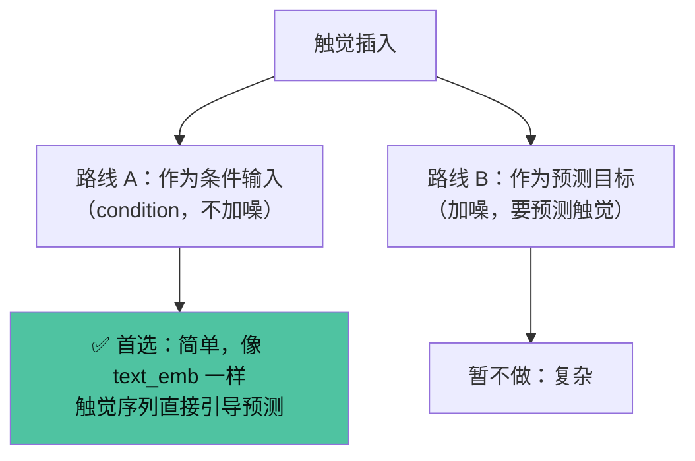
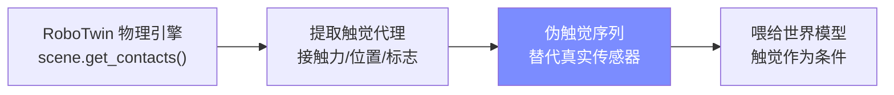
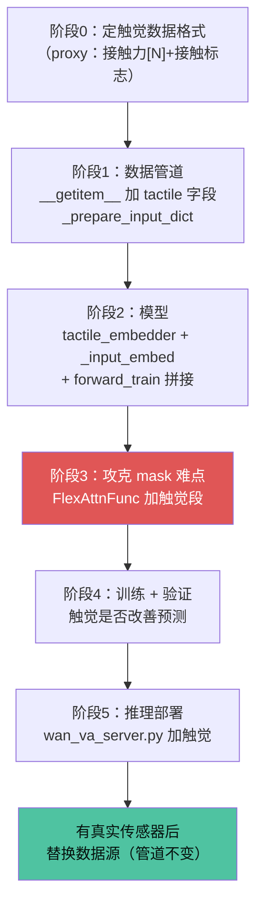

# 触觉二次开发方案（TACTILE_PLAN）

> 状态：规划中。基于 `TACTILE_ANALYSIS.md`（6 处改动点）扩展，聚焦「无传感器时怎么启动」。

## 一、战略判断

- **触觉 × 世界模型是 MoSense 的核心差异化**——这是唯一能形成自主专利 + 技术壁垒的方向，比跑分更有价值。
- **当前无触觉传感器硬件**，但这不阻塞启动：先用**仿真触觉（proxy）**跑通整条管道，验证「触觉引导预测」是否有效，硬件到位后再替换数据源（代码管道不变）。

## 二、触觉插入的两条路线

## 三、仿真触觉 proxy（无传感器的替代）

RoboTwin 物理引擎（SAPIEN）能提供的「触觉代理信号」：

| 可用信号 | 代码位置 | 作为触觉的含义 |
|---|---|---|
| 接触对 `scene.get_contacts()` | `_base_task.py` | 接触点 / 法线 / 接触力 |
| 夹爪-物体接触检测 | `get_gripper_actor_contact_position` | 抓取是否稳固 |
| 两物体接触判断 | `check_actors_contact` | 物体是否碰桌/碰架 |

→ 这些可拼成一条「伪触觉」序列（如 `[接触标志, 接触力, 接触位置]`），替代真实传感器，先跑通管道。

## 四、分阶段路线图

## 五、关键前置（动手前必须定）

1. **触觉代理的具体格式**：接触力向量 `[N]`？接触点位置 `[3]`？还是两者拼接 `[N+3]`？
2. **时序对齐**：触觉采样帧和相机帧、动作帧怎么对齐（同帧率？还是插值）？
3. **作为 condition 还是加噪**：proxy 建议走 condition（不加噪），最简。

## 六、关联文档

- `TACTILE_ANALYSIS.md` — 6 处代码改动点的原始分析
- `EVALUATION_RESULTS.md` — 评测能力画像（粗放强、精细弱，触觉正可补精细短板）
