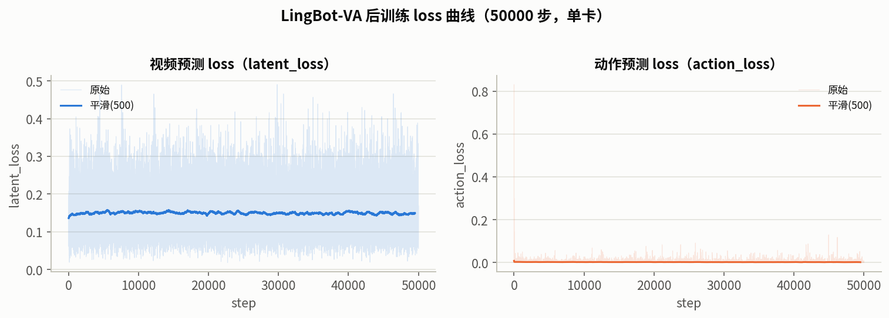
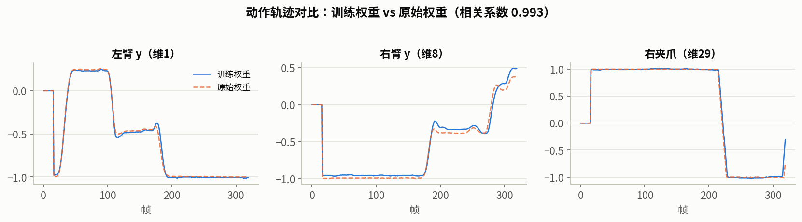
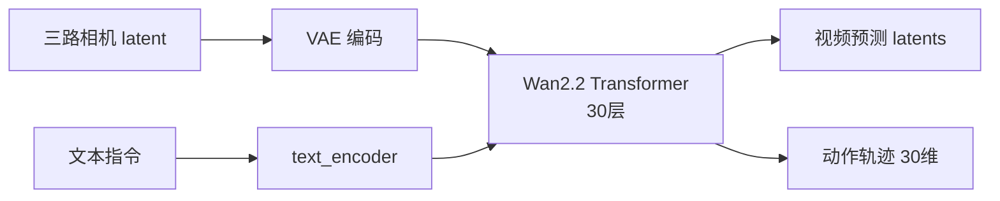
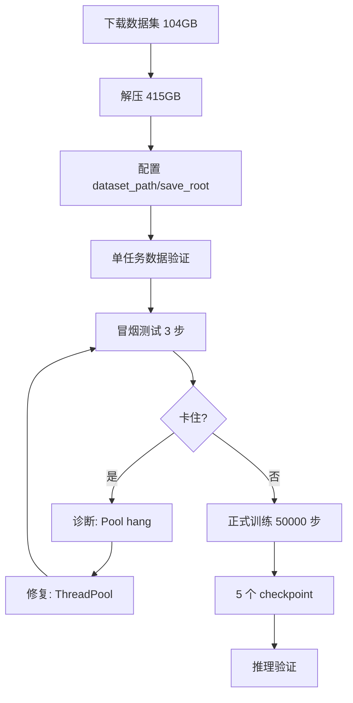

# LingBot-VA 阶段二训练报告

> 训练完成时间：2026-08-30 07:07（50000 步，单卡 RTX PRO 6000 Blackwell）
> 本文档整合训练结果、loss 分析、推理验证与工程细节。

## 一、训练概览

**结论一句话**：训练 50000 步完成，checkpoint 有效、可正常推理；`action_loss` 收敛（-61.5%），但 `latent_loss` 持平，且推理动作轨迹与原始权重几乎一致（相关系数 0.993）——训练对模型行为的改变较小，真实效果需评测确认。

| 指标 | 值 |
|---|---|
| 总步数 / 总时长 | 50000 步 / 16h33m |
| 步速 | 1.19 秒/步 |
| 最终 latent_loss | 0.1692 |
| 最终 action_loss | 0.0012 |
| checkpoint | 5 个（step 1w/2w/3w/4w/5w，每个 10.2GB） |
| GPU 温度 | 全程 86-90°C |

## 二、训练配置

| 项 | 值 |
|---|---|
| 模型 | LingBot-VA posttrain-robotwin（transformer，30 层，3072 隐维） |
| 数据集 | robotwin-clean-and-aug-lerobot（100 子数据集，27500 episode） |
| 单卡 | RTX PRO 6000 Blackwell（96GB） |
| num_steps / batch_size | 50000 / 1 |
| learning_rate / warmup | 1e-5 / 10 步 |
| save_interval | 10000（5 个 checkpoint） |
| 数据加载 | ThreadPool（修复 `multiprocessing.Pool` hang） |
| attn_mode | flex（训练）/ torch（推理） |

## 三、训练过程与 loss 分析

**loss 分段统计**：

| 阶段 | latent_loss 均值 | action_loss 均值 |
|---|---|---|
| 0-5000 | 0.1476 | 0.0035 |
| 20000-25000 | 0.1509 | 0.0025 |
| 45000-50000 | 0.1488 | 0.0024 |

**关键发现**：
- ✅ `action_loss` 从 0.0060 降到 0.0023，**下降 61.5%**——动作预测收敛
- ⚠️ `latent_loss` 全程持平在 0.148-0.152，**未下降**——视频预测未随训练改善

## 四、推理验证（用 step 50000 checkpoint）

用训练得到的 checkpoint 跑 i2va 独立推理，验证权重有效性：

| 检查项 | 结果 |
|---|---|
| checkpoint 加载 | ✅ 成功 |
| 动作值域 | [-1.06, 1.27]，无 NaN |
| 双臂动作 | 0-13 维有正常变化 |
| 预测视频 | 77 帧 320×384 10fps，有内容有运动 |

**动作轨迹对比（训练 vs 原始预训练权重）**：

- 相关系数 **0.993**，绝对差异均值 0.018
- 结论：训练后动作输出与原始权重**几乎一致**

## 五、训练质量评估（诚实结论）

| 维度 | 结论 |
|---|---|
| 训练完成、checkpoint 有效 | ✅ 确定 |
| 动作学习 | ✅ action_loss 收敛 61.5%（但绝对值低） |
| 视频学习 | ⚠️ latent_loss 持平，未改善 |
| 模型行为改变 | ⚠️ 推理动作与原始几乎一致 |
| success rate | ❓ 未评测（评测环境未搭建） |

**核心判断**：loss 和推理都表明训练**没有显著改变模型行为**。可能原因（推测，未验证）：`lr=1e-5` 过小、或模型已在预训练权重上收敛、微调空间小。**权威结论需跑 RoboTwin success rate 评测。**

## 六、工程细节

### 6.1 环境依赖（lingbot conda 环境）

- torch 2.9.0+cu128（Blackwell 必须 cu128）、lerobot 0.3.3、numpy 1.26.4、scipy 1.15.3

### 6.2 checkpoint 说明

- 每个 checkpoint 10.2GB（`transformer/diffusion_pytorch_model.safetensors` + `config.json`）
- 保存位置：`/media/mosense/Data2TB/fred/lingbot-va-train-out/checkpoints/`
- **不支持断点续训**（optimizer state 未保存，见 issue #72）

### 6.3 关键踩坑与修复

- **`multiprocessing.Pool` 多进程 hang** → 改 `ThreadPool`（对应官方 issue #32）
- 详见 [PHASE2_TRAINING.md](PHASE2_TRAINING.md) 第八章

## 七、流程图

### 7.1 训练数据流

### 7.2 训练执行流程

---

## 附：文件清单（本次新增）

- `TRAINING_REPORT.md`（本报告）
- `assets/loss_curve.png`（loss 曲线）
- `assets/action_compare.png`（动作对比）
- `TRAINING_LOG.md`（过程日志）
