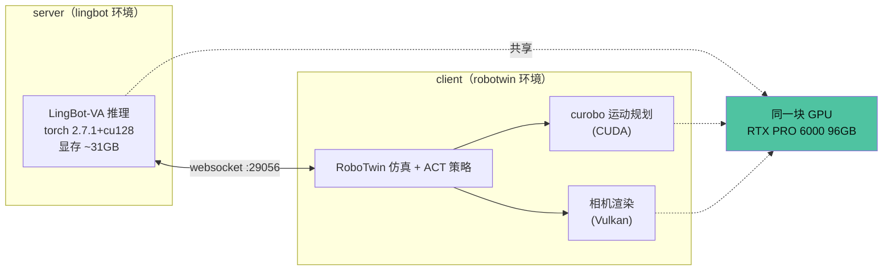
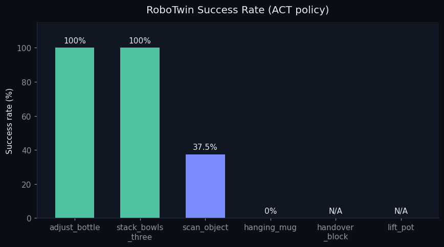
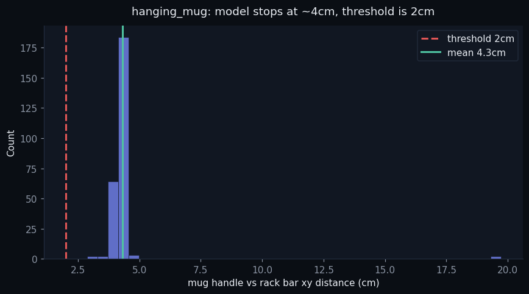
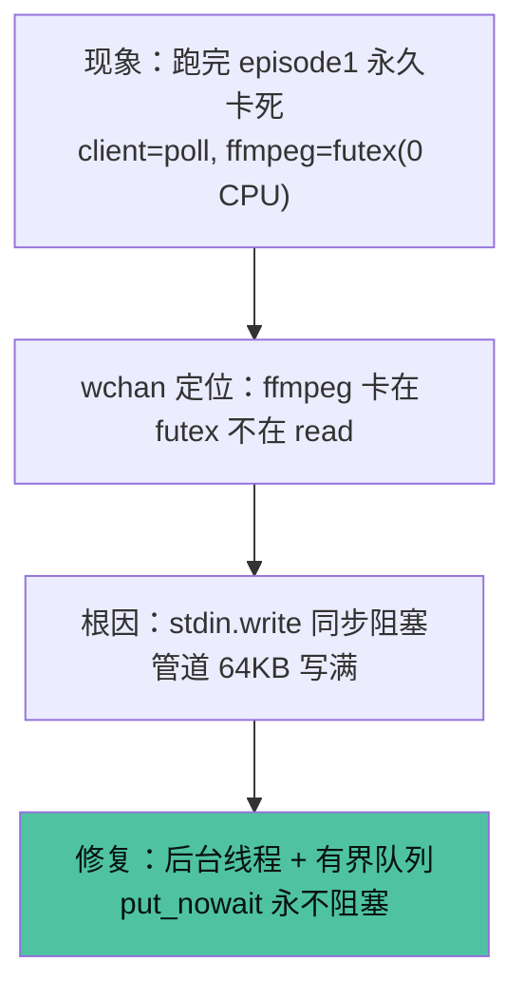
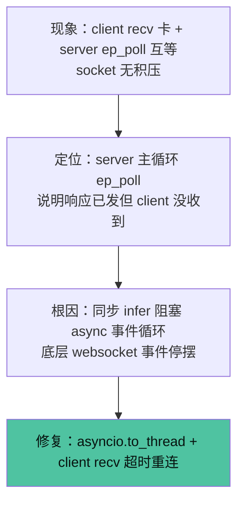
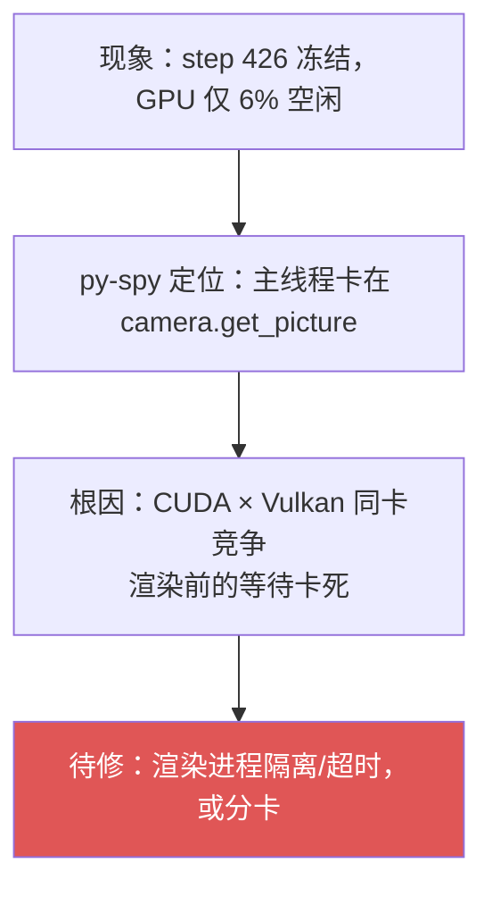
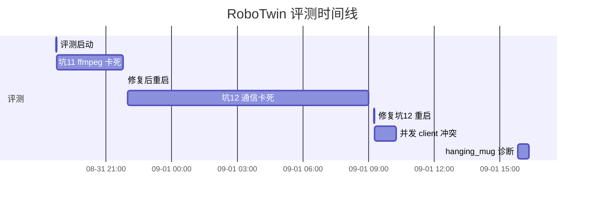
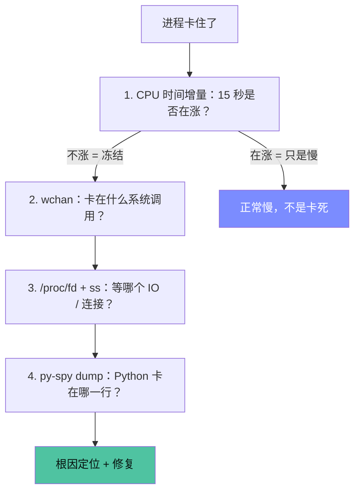

# 评测可视化总览（Visualization）

> 用图说话。架构、结果、卡死诊断、时间线一页看懂。

## 一、评测双环境架构（同卡竞争 CUDA × Vulkan）

> ⚠️ 坑 13 的根因就在这张图里：CUDA（server 推理 + client curobo）和 Vulkan（client 相机渲染）挤在同一块 GPU 上，竞争导致相机 `get_picture` 偶发卡死。

## 二、各任务成功率

## 三、hanging_mug 判定距离诊断（一图看懂「差 2cm」）

> 模型把杯子举到挂杆附近后，杯柄距离稳定停在 **~4cm**，够不到 2cm 判定阈值——「最终精确对准」能力不足，非判定 bug（判定 bug 已修复，见 EVALUATION_RESULTS.md）。

## 四、三个卡死的诊断流程（现象 → 定位 → 根因 → 修复）

### 坑 11：ffmpeg 视频录制管道死锁

### 坑 12：client↔server websocket 通信僵局

### 坑 13：sapien 相机渲染 get_picture 卡死

## 五、评测时间线

## 六、卡死定位方法论（递进式）

> 关键教训：`wchan`/`/proc` 只能推断，**py-spy 才能一锤定音**（坑 13 靠它纠正了「curobo」的误判）。
